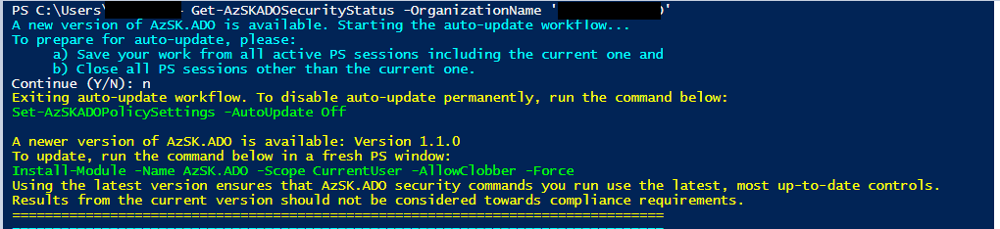
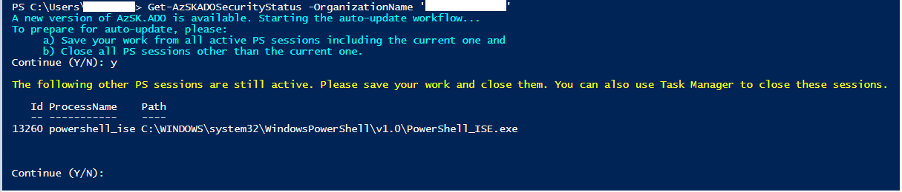

# AzSK.ADO PowerShell module

## Contents

  -  [Overview](Readme.md#overview)
  -  [Installation Guide](Readme.md#installation-guide)
  -  [Auto Update](Readme.md#auto-update)
  -  [FAQs](Readme.md#faqs)
  
  
----------------------------------------------

## Overview
Security Scanner for Azure DevOps (ADO) helps you keep your ADO artifacts such as various org/project settings, build/release configurations, service connections, agent pools, etc. configured securely. You can run the ADO Security Scanner standalone in a PowerShell console or in an ADO pipeline via a marketplace extension.

Security Scanner for Azure DevOps (ADO) performs security scanning for core areas of Azure DevOps like Organization, Projects, Users, Pipelines (Build & Release), Connections and Agent Pools. 

> At its core, the Security Scanner for ADO is a PowerShell module. This can be run locally from the PS console after installation. This is as simple as running PS in non-Admin mode and running the cmds as shown below:

----------------------------------------------

## Installation Guide

>**Pre-requisites**:
> - PowerShell 5.0 or higher. 

1. First verify that prerequisites are already installed:  
    Ensure that you have PowerShell version 5.0 or higher by typing **$PSVersionTable** in the PowerShell ISE console window and looking at the PSVersion in the output as shown below.) 
 If the PSVersion is older than 5.0, update PowerShell from [here](https://www.microsoft.com/en-us/download/details.aspx?id=54616).  
 
      

2. Install the Security Scanner for Azure DevOps (AzSK.ADO) PS module:  
	  
```PowerShell
  Install-Module AzSK.ADO -Scope CurrentUser -AllowClobber -Force
```
------------------------------------------------

### Auto Update
As Azure DevOps features evolve and add more security controls, "AzSK.ADO" also evolves every month respecting the latest security features.
It is always recommended to scan your organization with the latest AzSK.ADO module, thus ensuring to evaluate latest security controls that are available through the module.
"AzSK.ADO" module provides different auto update capabilities w.r.t different stages of devops. More details are below:

**Adhoc Scans:**
Users running the older version of AzSK.ADO scan from their local machine will get a warning as shown in the image below.
It would also provide the user with required instructions to upgrade the module.
 

The users can leverage the auto update feature which has been introduced from the AzSDK.ADO version 1.15.x.
As shown in the image above, user can go with update by running the command below:

```PowerShell
  Set-AzSKADOPolicySettings -AutoUpdate On|Off
```

User needs to close and reopen a fresh session once the command is run.
Going forward, if the latest version of AzSK.ADO is released, then during execution of any AzSK.ADO command it would start the auto update workflow automatically 
as shown in the image below:



Step 1: It would take user consent before it starts the auto update workflow. (1 in the image above) <br/>
Step 2: Users need to close all the displayed PS sessions. Typically open PS sessions would lock the module and fail the installation. (2 in the image above) <br/>
Step 3: Even the current session must be closed. It would again take the user consent before it starts the auto update flow to avoid the loss of any unsaved work. (3 in the image above)

**ADOScanner Extension:**
No impact to default behavior of ADOScanner extension. It always runs the scan with the latest version available in the PS Gallery. 

----------------------------------------------

### FAQs

#### Error message: "Running scripts is disabled on this system..."
This is an indication that PowerShell script loading and execution is disabled on your machine. You will need to enable it before the ADOScanner installation script (which itself is a PowerShell script) can run. 
```PowerShell
Get-ExecutionPolicy -Scope CurrentUser
```
If you run above command in the PS console, you will likely see that the policy level is either 'Restricted' or 'Undefined'. For AzSK cmdlets to run, it needs to be set to 'RemoteSigned'.
To resolve this issue run the following command in your PS console:
```PowerShell
Set-ExecutionPolicy -ExecutionPolicy RemoteSigned -Scope CurrentUser
```
The execution policy setting will be remembered and all future PS consoles opened in non-Admin (CurrentUser) mode will apply the 'RemoteSigned' execution policy.

#### How to register with PSGallery
Use below command :
```PowerShell
Register-PSRepository -Name PSGallery -SourceLocation https://www.powershellgallery.com/api/v2/ -InstallationPolicy Trusted
```
