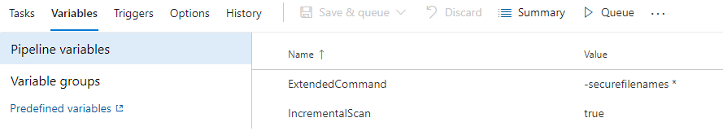
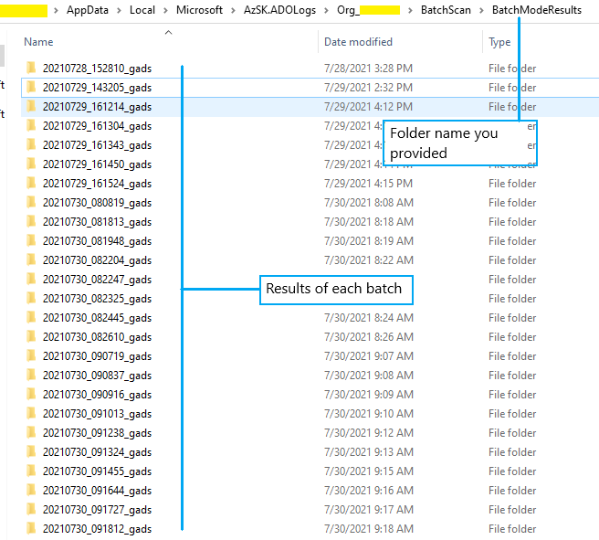
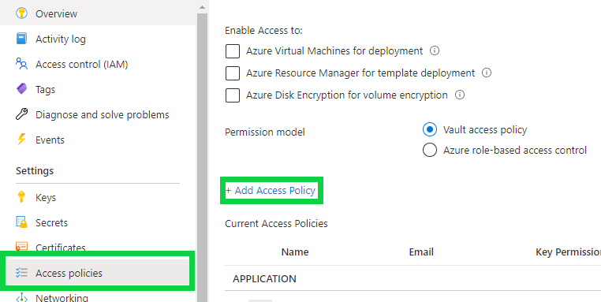
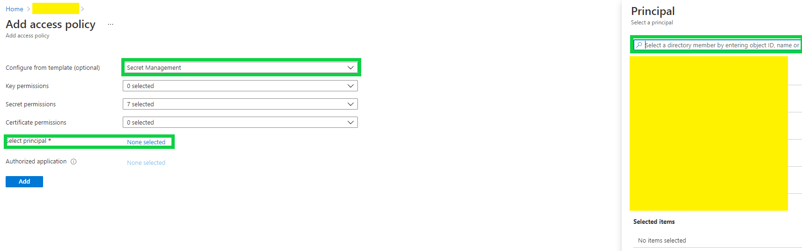

# AzSK.ADO PowerShell module

## Contents
 -  [Scan your Azure DevOps resources](Readme.md#scan-your-azure-devops-resources)
 -  [Execute SVTs using "-IncludeAdminControls" switch](Readme.md#execute-svts-using--includeadmincontrols-switch)
 -  [Execute SVTs using "-DetailedScan" switch](Readme.md#execute-svts-using--detailedscan-switch)
 -  [Execute SVTs using "-UsePartialCommits" switch](Readme.md#execute-svts-using--usepartialcommits-switch)
 	 -  [Speed up checkpointed scans with "-DoNotRefetchResources" switch](Readme.md#speed-up-checkpointed-scans-with--donotrefetchresources-switch) 
 	 -  [Combine security reports from checkpointed scans](Readme.md#combine-security-reports-from-checkpointed-scans) 
 -  [Scan pipelines incrementally](Readme.md#scan-pipelines-incrementally)
  	 - [Incremental Scan in CA](Readme.md#incremental-scan-in-ca)
	- [Incremental Scan in extension](Readme.md#incremental-scan-in-extension)
	 - [Scanning incrementally from a given date](Readme.md#scanning-incrementally-from-a-given-date)
	 - [Miscellaneous features in incremental scan](Readme.md#miscellaneous-features-in-incremental-scan)
 -  [Execute path based scanning for builds and releases](Readme.md#execute-path-based-scanning-for-builds-and-releases)
 -  [Scan ALT-account related controls using "-ALTControlEvaluationMethod" parameter](Readme.md#scan-alt-account-related-controls-using--altcontrolevaluationmethod-parameter)
 -  [Execute SVTs for large organizationss in batch mode](Readme.md#execute-svts-for-large-organizations-in-batch-mode)
	 - [Understanding the batch mode flow](Readme.md#understanding-the-batch-mode-flow)
	 - [Running batch mode in a VM](Readme.md#running-batch-mode-in-a-vm)
	 - [Combining security reports from all batches using GADSBMR](Readme.md#combining-security-reports-from-all-batches-using-gadsbmr)

## Scan your Azure DevOps resources

Run the command below after replacing `<OrganizationName>` with your Azure DevOps org Name 
and `<PRJ1, PRJ2, ..`> with a comma-separated list of project names where your Azure DevOps resources are hosted.
You will get Organization name from your ADO organization url e.g. "http<i></i>//sampleadoorg.visualstudio.com". In this 'sampleadoorg' is org name.

```PowerShell
Get-AzSKADOSecurityStatus -OrganizationName "<OrganizationName>" -ProjectNames "<PRJ1, PRJ2,...etc.>"
```

Command also supports other parameters of filtering resources.
For instance, you can also make use of the 'BuildNames','ReleaseNames' to filter specific resource

```PowerShell

#Scan organization
Get-AzSKADOSecurityStatus -OrganizationName "<OrganizationName>"

#Scan organization and Project
Get-AzSKADOSecurityStatus -OrganizationName "<OrganizationName>" -ProjectNames "<PRJ1,PRJ2,etc>" 

#Scan organization, project and builds
Get-AzSKADOSecurityStatus -OrganizationName "<OrganizationName>" -ProjectNames "PRJ1" -BuildNames "<BLD1, BLD2,...etc.>" 

#Scan organization, project and releases
Get-AzSKADOSecurityStatus -OrganizationName "<OrganizationName>" -ProjectNames "PRJ1" -ReleaseNames "<RLS1, RLS2,...etc.>" 

#Scan organization, project, all builds and releases
Get-AzSKADOSecurityStatus -OrganizationName "<OrganizationName>" -ProjectNames "PRJ1" -BuildNames "*" -ReleaseNames "*" 

#Scan organization, project and service connections
Get-AzSKADOSecurityStatus -OrganizationName "<OrganizationName>" -ProjectNames "PRJ1" -ServiceConnectionNames "<SER1, SER2,...ect.>"

#Scan organization, project and agent pools
Get-AzSKADOSecurityStatus -OrganizationName "<OrganizationName>" -ProjectNames "PRJ1" -AgentPoolNames "<AGP1, AGP2,...etc.>"

#Scan organization, project and Variable groups
Get-AzSKADOSecurityStatus -OrganizationName "<OrganizationName>" -ProjectNames "PRJ1" -VariableGroupNames "<VGN1,VGN2>"

#Scan organization, project, all builds, releases, service connectiopns and agent pools
Get-AzSKADOSecurityStatus -OrganizationName "<OrganizationName>" -ProjectNames "PRJ1" -BuildNames "*" -ReleaseNames "*" -ServiceConnectionNames "*" -AgentPoolNames "*"

#Scan organization, project, all builds, releases and variable groups
Get-AzSKADOSecurityStatus -OrganizationName "<OrganizationName>" -ProjectNames "PRJ1" -BuildNames "*" -ReleaseNames "*" -VariableGroupNames "*"

#Scan organization and Project with PAT prompted
Get-AzSKADOSecurityStatus -OrganizationName "<OrganizationName>" -ProjectNames "PRJ1" -BuildNames "*" -PromptForPAT

#Scan organization and Project with PAT token URL
Get-AzSKADOSecurityStatus -OrganizationName "<OrganizationName>" -ProjectNames "PRJ1" -ReleaseNames "*" -PATTokenURL

#Scan all supported artifacts
Get-AzSKADOSecurityStatus -OrganizationName "<OrganizationName>" -ScanAllResources

#Scan projects 
Get-AzSKADOSecurityStatus -OrganizationName "<OrganizationName>" -ProjectNames "<PRJ1,PRJ2,etc>" -ResourceTypeName Project

#Scan builds 
Get-AzSKADOSecurityStatus -OrganizationName "<OrganizationName>" -ProjectNames "PRJ1" -ResourceTypeName Build

#Scan releases 
Get-AzSKADOSecurityStatus -OrganizationName "<OrganizationName>" -ProjectNames "PRJ1"  -ResourceTypeName Release

#Scan service connections 
Get-AzSKADOSecurityStatus -OrganizationName "<OrganizationName>" -ProjectNames "PRJ1"  -ResourceTypeName ServiceConnection

#Scan agent pools 
Get-AzSKADOSecurityStatus -OrganizationName "<OrganizationName>" -ProjectNames "PRJ1"  -ResourceTypeName AgentPool

#Scan Variable group
Get-AzSKADOSecurityStatus -OrganizationName "<OrganizationName>" -ProjectNames "PRJ1"  -ResourceTypeName VariableGroup

#Scan all resources except organization, project and pipelines
Get-AzSKADOSecurityStatus -OrganizationName "<OrganizationName>" -ProjectNames "PRJ1" -ResourceTypeName SvcConn_AgentPool_VarGroup_CommonSVTResources 

#Scan any combination of resources (provide resource names for the resources you want to scan in any combination)
#The following command will scan all builds and repositories
Get-AzSKADOSecurityStatus -OrganizationName "<OrganizationName>" -ProjectNames "PRJ1" -BuildNames * -RepositoryNames * -ResourceTypeName Build_Release_SvcConn_AgentPool_VarGroup_User_CommonSVTResources 

#Scan using service Id
Get-AzSKADOSecurityStatus -OrganizationName "<OrganizationName>" -ProjectNames "PRJ1"  -ServiceId "<service Id>"

#Scan resources for baseline controls only
Get-AzSKADOSecurityStatus -OrganizationName "<OrganizationName>" -ProjectNames "<PRJ1,PRJ2,etc>" -ubc

#Scan resources with severity
Get-AzSKADOSecurityStatus -OrganizationName "<OrganizationName>" -ProjectNames "<PRJ1,PRJ2,etc>" -Severity "High/Medium/Low"

#Exclude controlIds in conjunction with other parameters such as ‘-ubc’ , '-Severity' or '-FilterTags' to scan all controls except the exclusions
Get-AzSKADOSecurityStatus -OrganizationName "<OrganizationName>" -ProjectNames "PRJ1" -Severity "High/Medium/Low"  -ExcludeControlIds "<ControlIdsToExclude>"
```

### Execute SVTs using "-IncludeAdminControls" switch

By default organization and project control is not including in scan for non-admin users. To scan organization and project controls, non-admin users needs to add a switch '-IncludeAdminControls' with scan command. 

```PowerShell
#Scan organization and Project (non-admin users)
Get-AzSKADOSecurityStatus -OrganizationName "<OrganizationName>" -ProjectNames "<PRJ1,PRJ2,etc>" -ScanAllResources -IncludeAdminControls
```
----------------------------------------------

### Execute SVTs using "-DetailedScan" switch

A special flag -DetailedScan in the scan command which can be used to tell the scanner to query and display richer information when evaluating certain controls. This is “off by default” and helps us scan RBAC controls at scale by avoiding API calls that can be deferred to a fix stage. 
```PowerShell
Get-AzSKADOSecurityStatus -OrganizationName "<OrganizationName>" -ScanAllResources -DetailedScan
```
Detailed information is also generated when -ControlIds or -ControlsToAttest flag is used. At present, the following controls support this flag, there detailed information can be seen below : 
|Control ID|Detailed Information|
|----------|--------------------|
|ADO_Organization_SI_Review_Installed_Extensions|List of extensions that: <br>(a) have not been updated by publishers for more than 2 years.<br> (b) have sensitive access permissions.<br> (c) are not production ready/in preview.<br> (d) are developed by top publishers in marketplace.<br> (e) have private visibility.|
|ADO_Build_AuthZ_Grant_Min_RBAC_Access|List of identities with their name and permissions that have been provided with minimum RBAC access to associated pipeline|
|ADO_Release_AuthZ_Grant_Min_RBAC_Access|List of identities with their name and permissions that have been provided with minimum RBAC access to associated pipeline|
|ADO_Organization_AuthZ_Justify_Guest_Identities|List of guest identities and their respective project entitlements in the organization.|


----------------------------------------------

### Execute SVTs using "-UsePartialCommits" switch

The Get-AzSKADOSecurityStatus command now supports checkpointing via a "-UsePartialCommits" switch. When this switch is used, the command periodically persists scan progress to disk. That way, if the scan is interrupted or an error occurs, a future retry can resume from the last saved state. This capability also helps in Continuous Assurance scans if scan gets suspended due to any unforeseen reason.The cmdlet below checks security control state via a "-UsePartialCommits" switch:
```PowerShell
Get-AzSKADOSecurityStatus-OrganizationName "<OrganizationName>" -ScanAllResources -UsePartialCommits
```
----------------------------------------------

#### Speed up checkpointed scans with "-DoNotRefetchResources" switch
The "-UsePartialCommits" switch also supports an optional switch: "-DoNotRefetchResources" in SDL mode. When this switch is used, resources are not re-fetched during the continuation of the checkpointed scan (i.e., when the "-upc" switch is used). This efficiently speeds up scans of subsequent batches after the initial one. Currently the resources supported with the switch are Release, Agent Pool, Organization and Project. 

```PowerShell
Get-AzSKADOSecurityStatus -OrganizationName "<OrganizationName>" -ProjectName "<ProjectName>" -ReleaseNames * -ResourceTypeName Release -UsePartialCommits -DoNotRefetchResources
```
----------------------------------------------
#### Combine security reports from checkpointed scans

In cases when a scan has been interrupted multiple times you may find individual checkpoint results scattered in your report folders. You can easily organize these results and also obtain a consolidated security report from all checkpoints using the following steps:
- Run the GADS command with upc switch and provide a folder name to store the results:
```PowerShell
Get-AzSKADOSecurityStatus-OrganizationName "<OrganizationName>" -ScanAllResources -UsePartialCommits -FolderName "<FolderName>"
```
All scan reports will now be stored under the path: _%LOCALAPPDATA%/Microsoft/AzSK.ADOLogs/OrgName/FolderName_
- Combine the security results using the _Get-AzSKADOSecurityCombinedResults (gadscr)_ command:

```Powershell
GADSCR -OrganizationName "<OrganizationName>" -FolderName "<FolderName>" -Mode "UPC"
```


----------------------------------------------

### Execute path based scanning for builds and releases
The Get-AzSKADOSecurityStatus command supports path based scanning by scanning build and release configs constrained to specific build and release folder paths. This is achieved via two switches : "-BuildsFolderPath" and "-ReleasesFolderPath".
```PowerShell
Get-AzSKADOSecurityStatus -OrganizationName "<OrganizationName>" -ProjectName "<ProjectName>" -ReleaseNames * -ResourceTypeName Release -ReleasesFolderPath "<ReleasesFolderPath>"

Get-AzSKADOSecurityStatus -OrganizationName "<OrganizationName>" -ProjectName "<ProjectName>" -BuildNames * -ResourceTypeName Build -BuildsFolderPath "<BuildsFolderPath>"
```
Consider the following build folder structure: </br>
<kbd>

</kbd>
 </br>
To scan builds inside "Folder 1", the path should be given as "Folder 1". This will scan all builds inside this folder (i.e., Build 1, Build 2 and Build 3). To scan all builds inside "Folder 2", the path should be "Folder 1\Folder 2". This will scan Build 1 and Build 2.

----------------------------------------------
### Scan resources incrementally
The Get-AzSKADOSecurityStatus command by default scans all the resources whose resource type you have specified. Situations may arise when resources have not been used/changed since the last scan was executed. In such scenarios, you may want to scan only those resources that have the potential to drift from compliance rather than every resource all over again. This will save the scan time as well as give you the most recent and relevant security status. You can achieve this using the *-IncrementalScan* switch.
 When you use this switch for the first time the scanner stores the timestamp as a reference for future scans. When you scan the resources the next time, not all of them will be scanned. Rather using the time from last scan only those resources will be scanned that have been modified/created since then.
 ```PowerShell
 #------------Scan builds incrementally------------------#
 Get-AzSKADOSecurityStatus -OrganizationName "<OrganizationName>"  -ProjectName "<ProjectName>"  -BuildNames *  -ResourceTypeName Build -IncrementalScan
 
 #------------Scan releases incrementally----------------#
 Get-AzSKADOSecurityStatus -OrganizationName "<OrganizationName>"  -ProjectName "<ProjectName>"  -ReleaseNames *  -ResourceTypeName Release -IncrementalScan
 
 #------------Scan variables groups incrementally----------------#
 Get-AzSKADOSecurityStatus -OrganizationName "<OrganizationName>"  -ProjectName "<ProjectName>"  -ResourceTypeName VariableGroup -IncrementalScan
```
>The incremental scan switch currently supports the following resources:
> - Builds 
> - Releases
>- Variable Groups
>- Feeds
>- Repositories
>- Secure Files
>- Environments  
#### Incremental Scan in CA
You can also leverage the feature of incremental scans in CA mode as well. Read more about CA [here](https://github.com/azsk/ADOScanner-docs/tree/master/04-Running%20ADOScanner%20as%20Azure%20Function).
To use incremental scan in CA, setup the CA mode for your project by following steps from [here](https://github.com/azsk/ADOScanner-docs/blob/master/04-Running%20ADOScanner%20as%20Azure%20Function/README.md#setting-up-adoscanner-using-azure-function---step-by-step). In the Extended Command configuration add the following:
```PowerShell
#------------Scan releases incrementally----------------#
-ResourceTypeName Release -IncrementalScan

#------------Scan builds incrementally------------------#
-ResourceTypeName Build -IncrementalScan

#------------Scan bvariables groups incrementally----------------#
-ResourceTypeName VariableGroup -IncrementalScan
```
#### Incremental Scan in Extension
Incremental scan can also be used in Extensions. Read about Extensions [here](https://github.com/azsk/ADOScanner-docs/tree/master/05-Running%20ADOScanner%20as%20pipeline%20extension). To use incremental scan in Extension, setup the extension in your pipeline by following the steps from [here](https://github.com/azsk/ADOScanner-docs/blob/master/05-Running%20ADOScanner%20as%20pipeline%20extension/README.md#setting-up-adoscanner-as-pipeline-extension---step-by-step). In the pipeline variables, provide the variable, "IncrementalScan" with value true.
</br>
<kbd>

</kbd>
 </br>

#### Scanning incrementally from a given date
You can also scan resources incrementally from a specified date rather than using the last scan time stamp. In such cases, all resources that have been modified/created since the given date will be eligible for scanning. To leverage this use the switch *-IncrementalDate*.
 ```PowerShell
 #------------Scan builds incrementally------------------#
 Get-AzSKADOSecurityStatus -OrganizationName "<OrganizationName>"  -ProjectName "<ProjectName>"  -BuildNames *  -ResourceTypeName Build -IncrementalScan -IncrementalDate "<Date>"
 
 #------------Scan releases incrementally----------------#
 Get-AzSKADOSecurityStatus -OrganizationName "<OrganizationName>"  -ProjectName "<ProjectName>"  -ReleaseNames *  -ResourceTypeName Release -IncrementalScan -IncrementalDate "<Date>"
 
 #------------Scan variable groups incrementally----------------#
 Get-AzSKADOSecurityStatus -OrganizationName "<OrganizationName>"  -ProjectName "<ProjectName>"  -ResourceTypeName VariableGroup -IncrementalScan -IncrementalDate "<Date>"
```

You can use the *-IncrementalDate* switch with CA as well by adding the switch in Extended Command as described above. To use the switch in Extension, add another variable "IncrementalDate" with the value as the date, in your pipeline.
>Keep the date format for *-IncrementalDate* switch as MM:DD:YYYY HH:MM:SS AM/PM

#### Miscellaneous features in incremental scan
- Scan attested resources: In case you have attested a resource and haven't modified since then, incremental scan will not scan the attested resource. You can override this behaviour using the *-ScanAttestedResources* switch

```Powershell
Get-AzSKADOSecurityStatus -OrganizationName "<OrganizationName>"  -ProjectName "<ProjectName>"  -ResourceTypeName Build_Release -IncrementalScan -ScanAttestedResources
```
- Full scan configuration: By default, incremental scan is configured to perform full scans for all resources every 7 days. You can configure this time period in your org policy settings. Read about org policy [here](https://github.com/azsk/ADOScanner-docs/tree/master/08-%20Customizing%20ADOScanner%20for%20your%20org).
```json
{
    "IncrementalScan":{
        "IncrementalScanValidForDays":7
    }
}
```
In case you want to override this behaviour and perform incremental scan even after threshold you can use the *-Force* switch
```Powershell
Get-AzSKADOSecurityStatus -OrganizationName "<OrganizationName>"  -ProjectName "<ProjectName>"  -ResourceTypeName Build_Release -IncrementalScan -Force
```
>We strongly recommend performing full scan atleast every 7 days in order to ensure a fully secure ADO ecosystem.
----------------------------------------------
### Execute SVTs for large organizations in batch mode

ADO Scanner supports another command, **Get-AzSKADOSecurityStatusBatchMode (gadsbm)**, to facilitate scanning of large organizations whose scanning may continue across hours on an end. In such scenarios the *gadsbm* command scans your pipelines in batches that reduces the load on your RAM and storage. In case the scan interrupts in between, you can resume the scan from the last unscanned batch without having to go through the process of collecting pipelines again. It uses the -upc switch implicitly  ensuring you double checkpoints - batch wise as well as inside a batch.
 > - Consider scanning your projects in batch mode when the number of pipelines in the project is greater than 20K
 > -  Batch mode currently supports build and release pipelines. For all other resources, you can scan using GADS command
 #### The GADSBM command and its parameters
A typical security scan command in batch mode will look like as follows:
```PowerShell
#-----------Scan given projects-----------------#
GADSBM -OrganizationName "<OrganizationName>" -ProjectNames "<ProjectName1>, <ProjectName2>" -ResourceTypeName Build_Release -BatchSize <BatchSize> -FolderName "<FolderName>" -PATTokenURL "<KeyVaultUrlContainingPAT>"

#----------Scan all projects------------#
GADSBM -OrganizationName "<OrganizationName>" -ProjectNames "*" -ResourceTypeName Build_Release -BatchSize <BatchSize> -FolderName "<FolderName>" -PATTokenURL "<KeyVaultUrlContainingPAT>"
```
> Make sure you have the latest version of AzSK.ADO installed. After installation, if there are any older versions of the module imported in the current session already, you should start the batch mode in a fresh console. This is to make sure that the changes from the latest module take effect.

 Following are the scan parameters that are specific to the GADSBM command :
 
| Parameter name |Purpose  | Required?| Possible values
|--|--|--|--|
| OrganizationName | Name of the organization being scanned |True | Valid organization name
|ProjectName | Name of the project being scanned |True | Valid project name
| PATTokenURL | KeyVault URL for PAT | True | Valid key vault url
| ResourceTypeName | Resource type to be scanned | True | Build, Release, Build_Release|
| FolderName | Name of the folder where batch results are to be stored| True| Folder name (if folder doesn't exists, it will be created)
|BatchSize| The number of pipelines to be scanned in one batch |False| Valid batch size number
|KeepConsoleOpen| Keep powershell console open after a batch completes| False

Apart from the above parameters, you can also use the following parameters that are supported in *gads* as well :

 - UseBaselineControls
 - FilterTags
 - ControlIds
 - BuildsFolderPath
 - ReleasesFolderPath
 - PolicyProject
 - DoNotOpenFolder
 - All bug logging related parameters
 
 #### Customizing batch size
 In addition to using the -BatchSize parameter to define the number of pipelines to scan in one batch, you can also configure the batch size value using org policy. To leverage this, make sure the org policy setup is complete in your project. Read more about org policy [here](https://github.com/azsk/ADOScanner-docs/tree/master/08-%20Customizing%20ADOScanner%20for%20your%20org).
	 - Copy the ControlSettings.json from the AzSK.ADO installation to your org-policy repo.
	 - Remove everything except the "*BatchTrackerUpdateFrequency*" line while keeping the JSON object hierarchy/structure intact.
```json
{
	"BatchScan":{
		"BatchTrackerUpdateFrequency":5000
	}
}
```
3.  Commit the file.
4.  Add an entry for *ControlSettings.json* in *ServerConfigMetadata.json*.

By default, the size is 5000 which you can configure. On specifying the -BatchScan parameter, this value will be overriden.

#### Understanding the batch mode flow
On running the GADSBM command, the scanner fetches only a specified number of pipelines in one go (via org policy or -BatchSize). It scans those pipelines and stores the results of the current batch in the folder *%LOCALAPPDATA%\Microsoft\AzSK.ADOLogs\Org_[yourOrganizationName]\BatchScan\\[FolderName]*. Here folder name is the name of the folder you specified in -FolderName parameter. </br>
<kbd>

</kbd>
 </br>
Once the current batch is complete, a fresh PS console opens which will fetch and scan the next batch of pipelines. The previous console closes (if not using the *-KeepConsoleOpen* switch) The process continues until all pipelines have been scanned, after which no new console will open. In case the scan is interrupted at any point, you can rescan using the same command which will result in starting the scan from the last unscanned batch. 

 >For best results with minimal strain on your system, we recommmend not using -KeepConsoleOpen. Each additional powershell console demands a share on your system resources that can slow it down. 

#### Running batch mode in a VM
Since batch mode is specifically designed for scanning large projects that can take several hours, you may wish to run the scanner in a VM. To run the scanner in the VM, you would have to provide Managed Identity access to the VM on your key vault. To do that follow the given steps:

 - Create a VM in Azure.
 - Select 'Identity' in your VM settings. Under System assigned, Status, select On and then click Save.
 - Create a Key Vault and add your PAT as a secret in the vault. The URL for this secret is what you can use for the gadsbm command.
 - Navigate to the Key Vault. Under 'Settings' go to 'Access Policies'.
 - Click on 'Add Access Policy'.
 - Under 'Configure from template' select 'Secret Management'.
 - Click on 'Select Principle' and add your VM here as the principal. Click on 'Select'.
 - Click on 'Add'
 </br>
 <kbd>

</kbd>
 </br>
  </br>
 <kbd>

</kbd>
 </br>
 
#### Combining security reports from all batches using GADSCR
The results of each individual batch will be in the respective folders in the folder path as defined above. For a consolidated summary and easy viewing of the logs, you may want to combine the security reports from all batch results folders into one combined security report. You can do this using the _Get-AzSKADOSecurityCombinedResults (gadscr)_ command.

```Powershell
GADSCR -OrganizationName "<OrganizationName>" -FolderName "<FolderName>" -Mode "GADSBM"
```
All security reports will be combined in one security report. The security report will contain the path to the logs for each resource which you can use to analyse the results. 
 
----------------------------------------------

### Scan ALT-account related controls using "-ALTControlEvaluationMethod" parameter

The Get-AzSKADOSecurityStatus command now supports ALT control evaluation using Graph API. The following ALT-account related controls now perform Graph queries to resolve group membership:
- ADO_Organization_AuthN_Use_ALT_Accounts_For_Admin
- ADO_Project_AuthN_Use_ALT_Accounts_For_Admin

The parameter can be used as follows:

|Parameter|Information|
|---------|-----------|
|GraphThenRegEx|The scanner first check for graph access on user identity and try to evaluate using Graph queries. If user/identity doesn't have graph access then scanner will evaluate control using regular expression.|
|Graph|The scanner will only use graph queries to evaluate the control.|
|RegEx|The scanner will only use regular expressions to evaluate the control.|


```PowerShell 
Get-AzSKADOSecurityStatus -OrganizationName $orgName -ALTControlEvaluationMethod Graph
```
