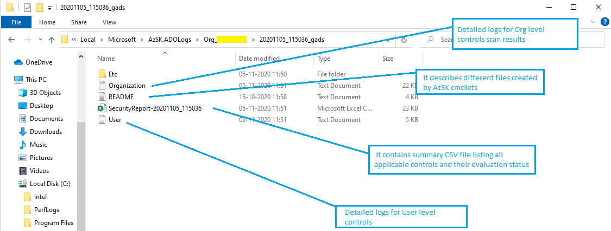
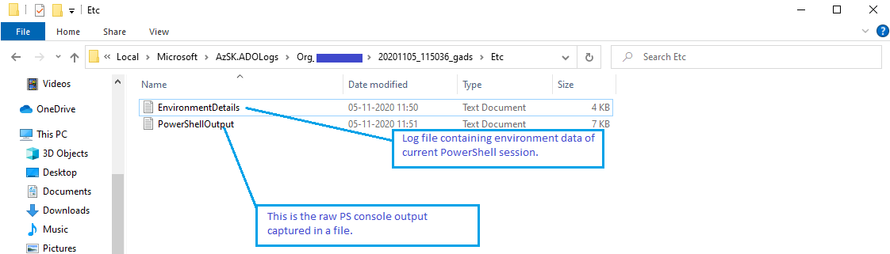
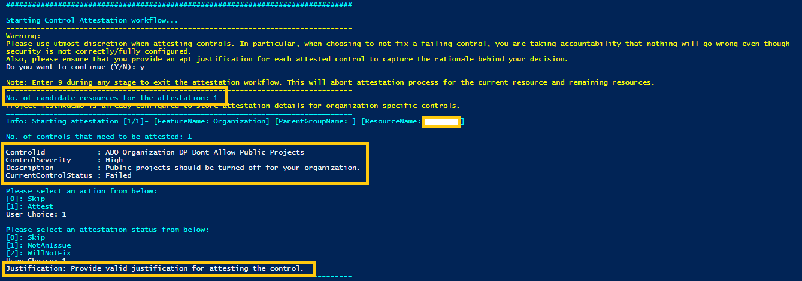
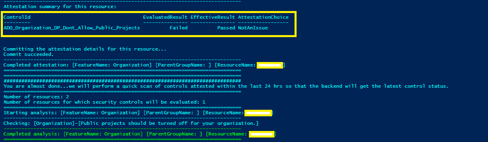
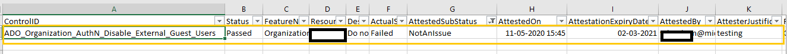
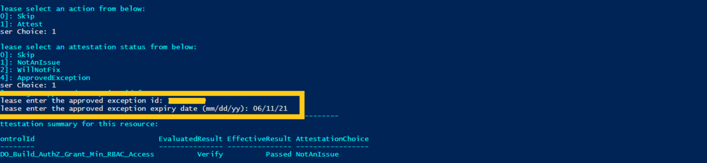

## Addressing control failures

## Contents
- [Understanding scan logs and CSV report](README.md#Understanding-scan-logs-and-CSV-report)
- [Control Attestation](README.md#Control-Attestation)
	- [Setup Repository to store attestation details](README.md#setup-attestation-repository)
  		 * [How to setup attestation repository in a project?](README.md#how-to-setup-attestation-repository-in-a-project)
  		 * [How to setup host project to store attestation details for organization-specific controls?](README.md#how-to-setup-host-project-to-store-attestation-details-for-organization-specific-controls)
	- [Starting attestation](README.md#starting-attestation)
	- [By Design attesation or approved exception](README.md#by-design-attestation-or-approved-exception)
	- [How scanner determines the effective control result](README.md#how-scanner-determines-the-effective-control-result)
	- [Permissions required for attesting controls](README.md#permissions-required-for-attesting-controls)
	- [Attestation expiry](README.md#attestation-expiry)

----------------------------------------------

## Understanding scan logs and CSV report

Each ADO scan cmdlet writes output to a folder whose location is determined as below:
- AzSK.ADO-Root-Output-Folder = %LocalAppData%\Microsoft\AzSK.ADOLogs
	```
	E.g., "C:\Users\userName\AppData\Local\Microsoft\AzSK.ADOLogs"
	```
- Sub-Folder = Sub_\<Subscription Name>\\\<Timestamp>_\<CommandAbbreviation>
	```
	E.g., "Org_[yourOrganizationName]\20201120_140515_gads"
	```
Thus, the full path to an output folder might look like:
```
E.g., "C:\Users\userName\AppData\Local\Microsoft\AzSK.ADOLogs\Org_[yourOrganizationName]\20201120_140515_gads\
```

> **Note**: By default, cmdlets open this folder upon completion of the cmdlet (we assume you'd be interested in examining the control evaluation status, etc.)

The contents of the output folder are organized as under:
<kbd>

<kbd>
- *\SecurityReport-\<timestamp>.csv*- This is the summary CSV file listing all applicable controls and their evaluation status.

- *\Etc*
	- *\PowerShellOutput.log* - This is the raw PS console output captured in a file.
	- *\EnvironmentDetails.log* - This is the log file containing environment data of current PowerShell session.
	<kbd>
	
	</kbd>
	- *\README.txt* - This README file describes how to interpret the different files created when AzSK cmdlets are executed

You can use these outputs as follows -
1. The SecurityReport.CSV file provides a quick glimpse of the control results. Investigate those that say 'Verify' or 'Failed'.
2. For 'Failed' or 'Verify' controls, look in the LOG files (search for 'failed' or by control-id). Understand what caused the control to fail.
3. For some controls, you can also use the 'Recommendation' field in the control output to get the PS command you may need to use.
4. Rerun the cmdlet and verify that the controls you tried to fix are passing now.

[Back to top…](README.md#contents)

----------------------------------------------

## Control Attestation

> **Note**: Please use utmost discretion when attesting controls. In particular, when choosing to not fix a failing control, you are taking accountability that nothing will go wrong even though security is not correctly/fully configured.
> </br>Also, please ensure that you provide an apt justification for each attested control to capture the rationale behind your decision.

The attestation feature empowers users to support scenarios where human input is required to augment or override the default control
evaluation status from AzSK.ADO. These may be situations such as:

- The scanner has generated the list of 'Administrators' for a project but someone needs to have a look at the list and ratify that
these are indeed the correct people, or
- The scanner has marked a control as failed. However, given the additional contextual knowledge, the application owner wants to ignore the control failure.

In all such situations, there is usually a control result that is based on the technical evaluation (e.g., Verify, Failed, etc.) that has to
be combined with the user's input in order to determine the overall or effective control result. The user is said to have 'attested' such controls
and, after the process is performed once, AzSK.ADO remembers it and generates an effective control result for subsequent control scans _until_ there
is a state change.

The attestation feature is implemented via a new switch called *ControlsToAttest* which can be specified in any of the standard security scan cmdlets
of AzSK.ADO. When this switch is specified, the scanner first performs a scan of the target resource(s) like it is business as usual and, once
the scan is complete, it enters a special interactive 'attest mode' where it walks through each resource and relevant attestable controls
and captures inputs from the user and records them (along with details about the person who attested, the time, etc.).
After this, for all future scans on the resource(s), AzSK.ADO will show the effective control evaluation results. Various options are provided to support
different attestation scenarios (e.g., expiry of attestations, edit/change/delete previous attestations, attest only a subset of controls, etc.).
These are described below. Also, for 'stateful' controls (e.g., "are these the right service accounts with access to project collection?"), the attestation
state is auto-reset if there is any change in 'state' (e.g., someone adds a new service account to the list).

Lastly, due to the governance implications, the ability to attest controls is available to a subset of users. This is described in
the permissions required section below.

[Back to top...](README.md#contents)

----------------------------------------------

## Setup Attestation Repository

AzSK.ADO internally stores attestation details in a project repository named 'ADOScannerAttestation' which needs to be configured typically by the project admin.

Attestation details for project and its components (build/release/service connection/agent pool) are recorded only when this repository is present inside the project.

> **Note:** Control attestation details for project and its components are stored inside the attestation repo present in the project.

> *Project Collection Administrator* needs to assign a project in the organization to host attestation details for organization-specific controls. See the next section for more details.

### How to setup attestation repository in a project?

In order to setup attestation repository inside a project, follow the below steps:

1. Navigate to *Repos* section of the project.
2. Create a new Git repository with the name 'ADOScannerAttestation'. Skip this step if this repository already exists.

### How to setup host project to store attestation details for organization-specific controls?

1. Host project to store attestation details for organization-specific controls can be set using a scan parameter named 'AttestationHostProjectName'. Before setting up the host project, ensure this project has 'ADOScanner_Attestation' repository setup.
2.  **Attestation host project can be set only once and can't be updated later**.

For e.g., to attest organization controls, run the command below:
```PowerShell
#Set attestation host project and attest organization controls:
$orgName = '<Organization name>'
$hostProjectName = '<Name of the host project to store attestation details of org-specific controls>'

Get-AzSKADOSecurityStatus -OrganizationName $orgName -AttestationHostProjectName $hostProjectName -ControlsToAttest NotAttested -ResourceTypeName Organization

```

----------------------------------------------

## Starting attestation

The AzSK.ADO scan cmdlets now support a new switch called ***ControlsToAttest***. When this switch is specified,
AzSK.ADO enters the attestation workflow immediately after a scan is completed. This ensures that attestation is done on the basis of the most current
control status.

All controls that have a technical evaluation status of anything other than 'Passed' (i.e., 'Verify' or 'Failed' or 'Manual' or 'Error') are considered
valid targets for attestation.

> **Note**: Some controls are very crucial from security stand point and hence AzSK.ADO does not support attesting them.

To manage attestation flow effectively, 4 options are provided for the *ControlsToAttest* switch to specify which subset of controls to target for attestation. These are described below:

|Attestation Option|Description|
|------------------|-----------|
|NotAttested|Attest only those controls which have not been attested yet.|
|AlreadyAttested|Attest those controls which have past attestations. To re-attest or clear attestation.|
|All|Attest all controls which can be attested (including those that have past attestations).|
|None|N/A.|

The attestation feature internally stores attestation details in a repository called 'ADOScannerAttestation'. As a prerequisite, you need to create a repository with the same name. Attestation details of projects, builds, releases, service connections, agent pools and variable groups will be stored in the 'ADOScanner_Attestation' repository of the project these resources belong to.

To attest organization specific controls, you need to setup a similar repository in the host project which will store the attestation details for organization specific controls.
> **Note**: Administrator needs to setup the attestation host project name to store organization specific control attestation details. It can be set using the parameter 'AttestationHostProjectName'. Attestation host project can be set only once and can not be update later.
Run below command to set attestation host project:
For example:
```PowerShell
#Set attestation host project and attest organization controls:
$orgName = '<Organization name>'
$attHotProjectName = '<Project name>'
Get-AzSKADOSecurityStatus -OrganizationName $orgName -AttestationHostProjectName $attHotProjectName -ControlsToAttest NotAttested -ResourceTypeName Organization

```

Attestation can be performed for orgnization, project, build, release, service connection and agent pool using the below commands:
> **Note**: Using PolicyProject parameter you can specify the name of the project to read and write attestation details and fetch organization policy for organization.

For example:
```PowerShell
#Using PolicyProject parameter
$orgName = '<Organization name>'
$policyProject = '<Name of the project hosting organization policy with which the scan should run.>'
Get-AzSKADOSecurityStatus -OrganizationName $orgName -PolicyProject $policyProject -ControlsToAttest NotAttested -ResourceTypeName Organization

#To attest organization controls, run the command below:
$orgName = '<Organization name>'
Get-AzSKADOSecurityStatus -OrganizationName $orgName -ControlsToAttest NotAttested -ResourceTypeName Organization

#To attest project controls, run the command below:

See the examples below to attest organization, project, build, release, service connection and agent pool controls.
```PowerShell

#Attest organization controls:
$orgName = '<Organization name>'

Get-AzSKADOSecurityStatus -OrganizationName $orgName -ControlsToAttest NotAttested -ResourceTypeName Organization

#Attest project controls:

$orgName = '<Organization name>'
$prjName = '<Project name>'

Get-AzSKADOSecurityStatus -OrganizationName $orgName -ProjectNames $prjName -ControlsToAttest NotAttested -ResourceTypeName Project

#To attest builds controls, run the command below:
$orgName = '<Organization name>'
$prjName = '<Project name>'
$buildName = '<Build name>'
Get-AzSKADOSecurityStatus -OrganizationName $orgName -ProjectNames $prjName -BuildNames $buildName -ControlsToAttest NotAttested -ResourceTypeName Build

#To attest release controls, run the command below:
$orgName = '<Organization name>'
$prjName = '<Project name>'
$releaseName = '<Release name>'
Get-AzSKADOSecurityStatus -OrganizationName $orgName -ProjectNames $prjName -ReleaseNames $releaseName -ControlsToAttest NotAttested -ResourceTypeName Release

#To attest service connection controls, run the command below:
$orgName = '<Organization name>'
$prjName = '<Project name>'
$serviceConnectionName = '<Service Connection name>'
Get-AzSKADOSecurityStatus -OrganizationName $orgName -ProjectNames $prjName -ServiceConnectionNames $serviceConnectionName -ControlsToAttest NotAttested -ResourceTypeName ServiceConnection

#To attest agent pool controls, run the command below:
$orgName = '<Organization name>'
$prjName = '<Project name>'
$agentPoolName = '<Agent pool name>'
Get-AzSKADOSecurityStatus -OrganizationName $orgName -ProjectNames $prjName -AgentPoolNames $agentPoolName -ControlsToAttest NotAttested -ResourceTypeName AgentPool

#Organization, project, build, release, service connection and agent pool controls can be attest in same command also, run the command below:

#Attest build controls:
$orgName = '<Organization name>'
$prjName = '<Project name>'
$buildName = '<Build name>'

Get-AzSKADOSecurityStatus -OrganizationName $orgName -ProjectNames $prjName -BuildNames $buildName -ControlsToAttest NotAttested -ResourceTypeName Build

#Attest release controls:
$orgName = '<Organization name>'
$prjName = '<Project name>'
$releaseName = '<Release name>'

Get-AzSKADOSecurityStatus -OrganizationName $orgName -ProjectNames $prjName -ReleaseNames $releaseName -ControlsToAttest NotAttested -ResourceTypeName Release

#Attest service connection controls:
$orgName = '<Organization name>'
$prjName = '<Project name>'
$serviceConnectionName = '<Service Connection name>'

Get-AzSKADOSecurityStatus -OrganizationName $orgName -ProjectNames $prjName -ServiceConnectionNames $serviceConnectionName -ControlsToAttest NotAttested -ResourceTypeName ServiceConnection

#Attest agent pool controls:
$orgName = '<Organization name>'
$prjName = '<Project name>'
$agentPoolName = '<Agent pool name>'

Get-AzSKADOSecurityStatus -OrganizationName $orgName -ProjectNames $prjName -AgentPoolNames $agentPoolName -ControlsToAttest NotAttested -ResourceTypeName AgentPool

#Organization, project, build, release, service connection and agent pool controls can be attested in same command too.

$orgName = '<Organization name>'
$prjName = '<Project name>'
$buildName = '<Build name>'
$releaseName = '<Release name>'
$serviceConnectionName = '<Service Connection name>'
$agentPoolName = '<Agent pool name>'

Get-AzSKADOSecurityStatus -OrganizationName $orgName -ProjectNames $prjName -BuildNames $buildName -ReleaseNames $releaseName -ServiceConnectionNames $serviceConnectionName  -AgentPoolNames $agentPoolName -ControlsToAttest NotAttested
```

As shown in the images, the command enters 'attest' mode after completing a scan and does the following:

1. For each resource that was scanned, if a control is a target for attestation, control details (such as description, severity, etc.) and the current evaluation result are displayed (to help the user)
2. The user gets to choose whether they want to attest the control
3. If the user chooses to attest, attestation details (attest status, justification, etc.) are captured
4. This is repeated for all attestable controls and each resource.

 Sample attestation workflow in progress:
 <kbd>
 
 </kbd>
 Sample summary of attestation after workflow is completed:
 <kbd>
 
 </kbd>
Attestation details corresponding to each control (e.g., justification, user name, etc.) are also captured in the CSV file as shown below:
<kbd>
 
</kbd>
If you wish to revisit previous attestations, it can be done by using 'AlreadyAttested' flag in the command above.

[Back to top...](README.md#contents)

----------------------------------------------
## By Design Attesation or Approved Exception
The exception feature empowers users to support attestation scenarios where valid exception/attestation id is required to attest the controls. This exception id can be generated as a part of bussiness process and can be used to track the approval and justification of the attestation.

For e.g., to attest organization controls using approved exception, run the command below:
```PowerShell
#Set attestation host project and attest organization controls:
$orgName = '<Organization name>'
$attHotProjectName = '<Project name>'
$approvedExceptionId = '<exception id>'
$approvedExceptionExpiryDate = '<mm/dd/yy>'
Get-AzSKADOSecurityStatus -OrganizationName $orgName -AttestationHostProjectName $attHotProjectName -ControlsToAttest NotAttested -ResourceTypeName Organization -AttestationStatus ApprovedException -ApprovedExceptionID $approvedExceptionId  -ApprovedExceptionExpiryDate $approvedExceptionExpiryDate

```
By design/Approved exception can be mandated to list of controls using the below properties in ControlSettings.json. When EnforceApprovedException is enabled with list of controls, those controls will obligatorily require exception id to attest irrespective of attestation status(NotAnIssue/WillNotFix/ApprovedException).

```javascript
{
	"EnforceApprovedException": true/false,
	"ApprovedExceptionSettings": {
		"ControlsList": [],
		"InvalidatePreviousAttestations": true/false,
		"ApprovedExceptionPromptMessage": "",
		"ByDesignExceptionPromptMessage": "",
		"DefaultPromptMessage": ""
	}
}
```

The following table shows the description of above fields to enforce approved exception.
- 'EnforceApprovedException' if enabled, will mandate the  exception/attestation attesation for configured controls list.
- 'ControlsList' represents the controls for which exception/attestation id is mandated. The controls listed here are mandated to attest using exception id irrespective of attestation status.
- 'ApprovedExceptionPromptMessage' represents the message to be prompted to fetch the exception id for approved exception.
- 'ByDesignExceptionPromptMessage' represents the message to be prompted to fetch the exception id forby design exceptions.
- 'DefaultPromptMessage' will be prompted as default message if both ApprovedExceptionPromptMessage/ByDesignExceptionPromptMessage is empty.

Sample approved exception attestation workflow in progress:
<kbd>

</kbd>

[Back to top...](README.md#contents)

----------------------------------------------

## How scanner determines the effective control result

During the attestation workflow, the user gets to provide attestation status for each control attested. This basically represents the user's attestation preference w.r.t.
a specific control (i.e., whether the user wants to override/augment the scanner status and treat the control as passed or whether the user agrees with the scanner status but wants to defer fixing the issue for the time being):

|Attestation Status | Description|
|---|---|
|None | There is no attestation done for a given control. User can select this option during the workflow to skip the attestation|
|NotAnIssue | User has verified the control data and attesting it as not an issue with proper justification to represent situations where the control is implemented in another way, so the finding does not apply. |
|WillNotFix | User has verified the control data and attesting it as not fixed with proper justification|
|ApprovedException | User has verified the control data and attesting it as approved exception with proper exception id obtained as a part of bussiness process. This exception id can be used to track the justification and approval for attestation|

The following table shows the complete 'state machine' that is used by AzSK.ADO to support control attestation.
The columns are described as under:
- 'Control Scan Result' represents the technical evaluation result
- 'Attestation Status' represents the user choice from an attestation standpoint
- 'Effective Status' reflects the effective control status (combination of technical status and user input)
- 'Requires Justification' indicates whether the corresponding row requires a justification comment
- 'Comments' outlines an example scenario that would map to the row

|Control Scan Result  |Attestation Status |Effective Status|Requires Justification | ExpiryInDays| Comments |
|---|---|---|---|---|---|
|Passed |None |Passed |No | -NA- |No need for attestation. Control has passed outright!|
|Verify |None |Verify |No | -NA- |User has to ratify based on manual examination of AzSK.ADO evaluation log. E.g., Project Collection Service Account list.|
|Verify |NotAnIssue |Passed |Yes | 90 |User has to ratify based manual examination that finding does not apply as the control has been implemented in another way.|
|Verify |WillNotFix |Exception |Yes | Based on the control severity table below|Valid security issue but a fix cannot be implemented immediately.|
|Failed |None |Failed |No | -NA- | Control has failed but has not been attested. Perhaps a fix is in the works...|
|Failed |NotAnIssue |Passed |Yes | 90 |Control has failed. However, the finding does not apply as the control has been implemented in another way.|
|Failed |WillNotFix |Exception |Yes | Based on the control severity table below| Control has failed. The issue is not benign, but the user has some other constraint and cannot fix it.|
|Error |None |Error |No | -NA- | There was an error during evaluation. Manual verification is needed and is still pending.|
|Error |NotAnIssue |Passed |Yes | 90| There was an error during evaluation. Manual verification by user indicates that the finding does not apply as the control has been implemented in another way.|
|Error |WillNotFix |Exception |Yes | Based on the control severity table below| There was an error during evaluation. Manually verification by the user indicates a valid security issue.|
|Manual |None |Manual |No | -NA-| The control is not automated and has to be manually verified. Verification is still pending.|
|Manual |NotAnIssue |Passed |Yes | 90| The control is not automated and has to be manually verified. User has reviewed the security concern and implemented the fix in another way.|
|Manual |ApprovedException |Passed |Yes | Based on the configured approved exception expiry date| The control is not automated and has to be manually verified. User has reviewed and found a security issue to be fixed.|
|Failed |ApprovedException |Passed |Yes | Based on the configured approved exception expiry date|Control has failed. However, the finding does not apply as the control has been implemented in another way.|
|Error |ApprovedException |Passed |Yes |  Based on the configured approved exception expiry date| There was an error during evaluation. Manual verification by user indicates that the finding does not apply as the control has been implemented in another way.|


-NA- => Not Applicable

Control Severity Table:

|ControlSeverity| ExpiryInDays|
|----|---|
|Critical| 7|
|High   | 30|
|Medium| 60|
|Low| 90|


<br>
The following table describes the possible effective control evaluation results (taking attestation into consideration).

|Control Scan Result| Description|
|---|---|
|Passed |Fully automated control. Azure DevOps artifact configuration meeting the control requirement|
|Verify |Semi-automated control. It would emit the required data in the log files which can be validated by the user/auditor.|
|Failed |Fully automated control. Azure DevOps artifact configuration not meeting the control requirement|
|Error |Automated control. Currently failing due to some exception. User needs to validate manually|
|Manual |No automation as of now. User needs to validate manually|
|Exception |Risk acknowledged. The 'WillNotFix' option was chosen as attestation choice/status. |

[Back to top...](README.md#contents)

----------------------------------------------

## Permissions required for attesting controls:
Attestation is supported for organization and project controls only with admin privileges on organization and project, respectively.

In order to attest build, release, service connection and agent pool controls, user needs to have atleast contributor access on the 'ADOScanner_Attestation' repository of project these resources belong to.

Note: The attestation data stored in the 'ADOScanner_Atestation' repository is opaque from an end user standpoint. Any attempts to access/change it may impact correctness of security evaluation results.

Currently, attestation can be performed only via PowerShell session in local machine, but the scan results will be honored in both local as well as extension scan.

> **Note**:
>* In order to attest organization control, user needs to be a member of the group 'Project Collection Administrators'.
>* In order to attest project control, user needs to be a member of the group 'Project Administrators' of that particular project.
>* In order to attest build, release, service connection, agent pool control, user needs to have write permission on the 'ADOScanner_Attestation' repository of that particular project.

[Back to top...](README.md#contents)

----------------------------------------------

## Attestation expiry:
All the control attestations done through AzSK.ADO is set with a default expiry. This would force teams to revisit the control attestation at regular intervals.
Expiry of an attestation is determined through different parameters like control severity, attestation status etc.
There are two simple rules for determining the attestation expiry. Those are:

Any control with evaluation result as not passed and,
 1. attested as 'NotAnIssue', such controls would expire in 90 days.
 2. attested as 'WillFixLater', such controls would expire based on the control severity table below.

|ControlSeverity| ExpiryInDays|
|----|---|
|Critical| 7|
|High   | 30|
|Medium| 60|
|Low| 90|

> **Note**:
>* Attestation may also expire before actual expiry in cases when the attested state for the control doesn't match with current control state.

[Back to top...](README.md#contents)
