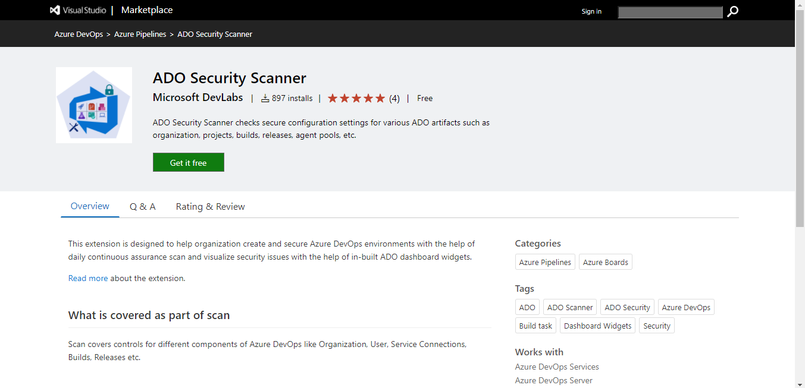
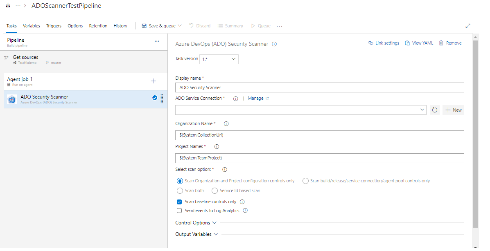
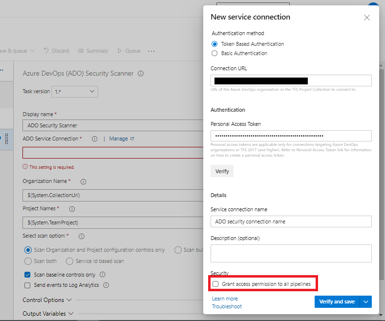

# Running ADOScanner as pipeline extension

## Contents

  -  [Automated Scanning using ADO extension](README.md#automated-scanning-using-ado-extension)
     * [Setting up ADOScanner as pipeline extension - Step by Step](README.md#setting-up-adoscanner-as-pipeline-extension---step-by-step)
     * [Customizing your PAT with minimum required privileges for ADO Connection](README.md#-customizing-your-pat-with-minimum-required-privileges-for-azure-devops-connection)
     * [Visualize security scan results](README.md#visualize-security-scan-results)

## Automated Scanning using ADO extension

Security Scanner for ADO is also available as a native ADO extension that can be set up to scan your ADO artifacts periodically so as to achieve "continuous assurance". The extension also comes packaged with widgets that you can use to visualize scan results by relevance to stakeholder groups (such as org admin, project owners, build/release owners etc.) in dashboards.

The basic idea behind Continuous Assurance (CA) is to setup periodic security scan and if new, more secure options become available for a feature, it should be possible to detect so that an application or solution can benefit from them and notify/alert the owners concerned.

Scan is performed via security scanner task in the pipeline and results can be visualized via dashboard by adding ADO security scanner widgets into the Azure DevOps project's dashboard. Pipeline can be setup with the trigger to run periodically and provide continuous assurance.

### Setting up ADOScanner as pipeline extension - Step by Step

In this section, we will walk through the steps of setting up an Azure DevOps pipeline for ADO Continuous Assurance coverage.
To get started, we need the following 

__Prerequisite:__

- ADO organization and project 
- "Project Collection Administrator" or "Owner" permission to perform below task:

  * Install "ADO Security Scanner" extension

  * Setup pipeline with scanner task.
    
  * Create dashboard to visualize scan results

#### Install "ADO Security Scanner" extension for your Azure DevOps Organization

Extension has been published to the Visual Studio marketplace gallery under "Azure DevOps > Azure Pipeline" category. You can now install this extension from the Marketplace directly (https://marketplace.visualstudio.com/items?itemName=azsdktm.ADOSecurityScanner).

Refer doc [here](https://docs.microsoft.com/en-us/azure/devops/marketplace/install-extension?view=azure-devops&tabs=browser) for more about installing extensions for org

   

#### Adding ADO Security Scanner in the pipeline

This part assumes that you are familiar with Azure DevOps build tasks and pipelines at a basic level. Our goal is to show how ADO Security Scanner can be added into the build/release workflow.

__Step-1__: Create a build pipeline or open an existing one.

__Step-2__: Add "ADO Security Scanner" task to the pipeline

Click on "Add Tasks" and select "Azure DevOps (ADO) Security Verification".

__Step-3__: Specify the input parameters for the task.
The "ADO Security Scanner" task starts showing in the "Run on Agent" list and displays some configuration inputs that are required for the task to run. These are none other than the familiar options we have been specifying while running the ADO scan manually - you can choose to specify the target org, projects, builds and releases based on how your org resources are organized.

> **Note:** This task also requires Azure DevOps connection containing org details and PAT to scan the required resources. Refer doc [here](https://docs.microsoft.com/en-us/azure/devops/organizations/accounts/use-personal-access-tokens-to-authenticate?view=azure-devops&tabs=preview-page) to create token and provide it as part of connection

<html>
<head>

</head><body>
<H3> Customizing your PAT with minimum required privileges for Azure DevOps Connection</H3>

Here is a scope-wise list of minimum privileges that needs to be assigned to your PAT to ensure a smooth experience of the security scan.

<table><tr><th>Scope</th><th>Privilege</th></tr>
<tr><td>
Agent Pools
</td><td>Read</tr>

<tr><td>
Auditing
</td><td>Read Audit Log</tr>

<tr><td>
Build
</td><td>Read</tr>

<tr><td>
Entitlements
</td><td>Read</tr>

<tr><td>
Extension Data
</td><td>Read & write</tr>

<tr><td>
Extensions
</td><td>Read</tr>

<tr><td>
Graph
</td><td>Read</tr>

<tr><td>
Identity
</td><td>Read</tr>

<tr><td>
Member Entitlement Management
</td><td>Read</tr>

<tr><td>
Project and Team
</td><td>Read</tr>

<tr><td>
Release
</td><td>Read</tr>

<tr><td>
Secure Files
</td><td>Read</tr>

<tr><td>
Service Connections
</td><td>Read</tr>

tr><td>
Task Groups
</td><td>Read</tr>

<tr><td>
Tokens
</td><td>Read & manage</tr>

<tr><td>
User Profile
</td><td>Read</tr>

<tr><td>
Variable Groups
</td><td>Read</tr>

<tr><td>
Work Items
</td><td>Read & write</tr>

</table>
<table>
</table>
</body></html>

__! Important__ : Make sure you **DO NOT** select  checkbox for "Grant access permission to all pipelines" before saving service connection. 

> **Note**: ADO Security Scanner extension enables you to leverage some of the advanced capabilities of scanner while running in adhoc mode. You could scan for only preview baseline controls in your build pipeline, or you could just scan for controls with specific severity etc. These advanced features are available to customers through ADO variables. For example, use *ExtendedCommand* variable in the pipeline with its value as *-Severity 'High'* to scan controls with high severity.

__Step-4__: Click "Save & queue"

Task will install latest ADO scanner module and start scanning based on input parameters. 

At the end, it will show the summary of scan and store the result in extension storage.

__Step-4__: Setup scheduled trigger for pipeline

Once you are able to successfully run the ADO scan using ADO pipeline, you can configure scheduled trigger to get latest visibility of security on resources

----------------------------------------------

### Visualize security scan results 

Once scan is completed as part of pipeline, results can be visualized with the help of project dashboard.

Extension mainly provides two widgets that can be added as part of dashboard

__* Org Level Security Scan Summary__: Displays org level security control evaluation summary. This dashboard helps org owners to take action based on control failures.

__* Project Component Security Scan Summary__: Displays project components (Build/Release/Connections) security control evaluation summary.

__Steps__:

1. Go to project dashboard under your organization and create new dashboard for org level summary

    

2. Click edit or add widget > Search for "__Org Level Security Scan Summary__" > Click 'Add' followed by "Done Editing"

    

3. Dashboard will start displaying scanned results 

    

Step 1,2 & 3 needs to be repeated to add "__Project Component Security Scan Summary__"

> **Note:**  Dashboard created will be visible to all users which are part of project.

> **Note:**  Dashboard reflects updates only upon pipeline execution. Local scan results don't reflect automatically. If you have remediated a control, make sure you run the pipeline to reflect the updated control results on dashboard.
