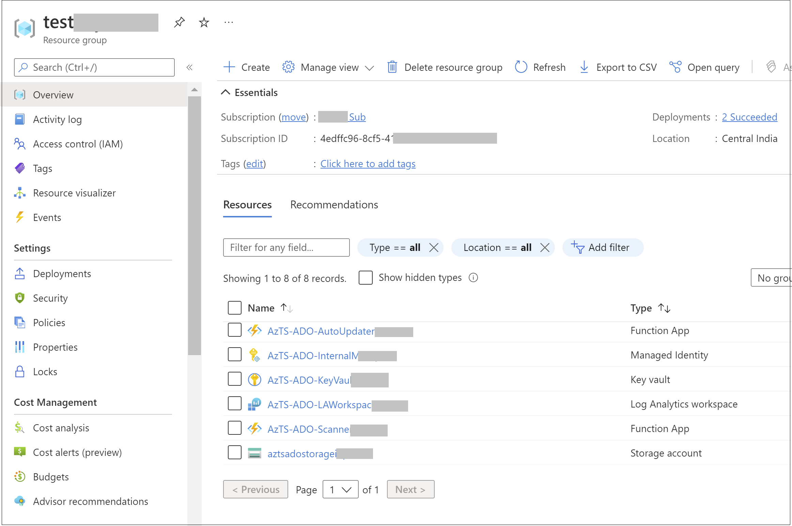

# Running ADOScanner as Azure Function (Continuous Assurance)

## Contents

  -  [Overview](README.md#overview)
  -  [Setting up AzTS-ADO Scanner using ARM template](README.md#automated-scanning-using-azure-functions-PAT-based-scanning)
     * [Setting up ADOScanner using Azure function - Step by Step](README.md#setting-up-adoscanner-using-azure-function---step-by-step)
  -  [Automated Scanning using Azure functions - OAuth app based scanning](README.md#automated-scanning-using-azure-functions-OAuth-app-based-scanning)
     * [Setting up ADOScanner using Azure function - Step by Step](README.md#setting-up-adoscanner-using-azure-function---step-by-step)
  - Other commands
     * [Updating an existing Continuous Assurance setup](README.md#updating-an-existing-continuous-assurance-setup)
     * [Getting details about a Continuous Assurance setup](README.md#getting-details-about-a-continuous-assurance-setup)
     * [Continuous Assurance using containers - how it works (under the covers)](README.md#continuous-assurance-using-containers---how-it-works-under-the-covers)

----------------------------------------------

## Overview

The Azure Tenant Security Solution (AzTS) from the AzSK team can be used to obtain visibility to Azure DevOps and resource configuration across multiple organizations in an enterprise environment. The AzTS is a logical progression of DevOps Kit which helps us move closer to an implementation of cloud security compliance solution using native security capabilities in Azure platform that are available today. Functionally, it is similar to running AzSK Continuous Assurance (CA) in central-scan mode.

In this section, we will walk through the steps of setting up AzTS Solution. This setup can take up to 30 minutes.

Let's start!

----------------------------------------------

## Setting up AzTS-ADO Scanner using ARM template

An AzTS based ADO scanning scanning solution for ADO can be setup in subscription. It will run ADO security scanner inside a function app and the scanning infrastructure of this model will be hosted in an Azure resource group. This provides an alternate option to running the scanner via ADO pipeline extension and is designed to be more suitable for larger environments.

### **Step 1 of 4. Validate prerequisites on machine**  

- An Azure account with an active subscription. [Create an account for free](https://azure.microsoft.com/free/dotnet).

- ADO token with readonly access (with required scopes mentioned in table) on target organizaiton that needs to be scanned. Currently scanner supports below two types of tokens.

   **i) Personal Access Token (PAT):** A PAT identifies you, your accessible organizations with scopes mentioned during creation of token. Refer [link](https://docs.microsoft.com/en-us/azure/devops/organizations/accounts/use-personal-access-tokens-to-authenticate?view=azure-devops&tabs=Windows#create-a-pat) to know more about PAT. Create PAT with below required scopes.  

   **ii) OAuth Access Token:** OAuth provides delegation protocol with authorization to web-enabled applications to generate access token on users behalf. Refer [link](https://docs.microsoft.com/en-us/azure/devops/integrate/get-started/authentication/oauth?view=azure-devops) to create OAuth access token. 

   **Required Scopes:**

   <table><tr><th>Scope</th><th>Privilege</th></tr>

   <tr><td>
   Project
   </td><td>Read</tr>
   <tr><td>
   Build
   </td><td>Read</tr>

   <tr><td>
   Variable groups
   </td><td>Read</tr>

   <tr><td>
   Service endpoints
   </td><td>Read</tr>

   </table>
   <table>
   </table>
   </body></html>

### **Step 2 of 4. Deploy AzTS-ADO Scanner using ARM template**  
 

Click on deploy to Azure link. It will redirect to Azure Portal. You can follow steps mentioned in the template form to create AzTS-ADO scanner resources. 

 

### **Step 3 of 4. Verify setup is complete**  

**i:** In the Azure portal, select the resource group in host subscription where ADO scanner is installed. You should see a Function App created by the name starting with 'AzTS-ADO-Scanner-XXXX'. There will also be some other resources App Service Plan, Key vault to store token, Application Insights, Storage to store scan logs, Log Analytics workspace.
  
<kbd>	

</kbd>

**ii:** Click on 'AzTS-ADO-Scanner' tile. It should show the following functions: 

**3:** Click on 'Configuration' tile. It should show the application settings of the function app. Default schedule is to run scan 20 minutes post Install CA command and then every 24 hours after that. In case -ScanInterval param is used while setting up CA, the first scan will run 20 minutes post Install CA command and then based on scan interval duration set in the command.

**Step-4: Verifying CA execution and Log Analytics connectivity**  
Once CA setup is completed successfully, the function app will automatically trigger (once a day) and scan the organization and the specified projects for the organization. The outcomes of these scans will be saved in a storage account created during installation (format : adoscannersa\<YYMMDDHHMMSS> e.g. adoscannersa200815181008)

The results of the control evaluation are also routed to the Log Analytics for viewing via a security dashboard.  
  
Let us verify that the function app output is generated as expected and that the Log Analytics connectivity is setup and working correctly.

**1:** Verify CSV file and LOG file are getting generated 
 
1. Go to Storage Explorer and look for a storage account with a name in adoscannersa<YYMMDDHHMMSS> format in your subscription in 'ADOScannerRG' resource group.
2. Find a blob container called 'ado-scan-logs' in this storage account.
3. There should be a ZIP file named using a timestamp based on the date time for the manual execution in this container (most likely the ZIP file with the most recent creation date). 
4. Download the ZIP file and extract its contents locally.
<kbd>	

</kbd>
**2:** Verify that data is being sent to the target Log Analytics workspace   

1. Go to the Log Analytics workspace that we used to setup CA above.
2. Navigate to 'Logs' window, and enter below query
  AzSK_ADO_CL | where Source_s == "CA"
3. You should see results similar to the below:
<kbd>	

</kbd>
