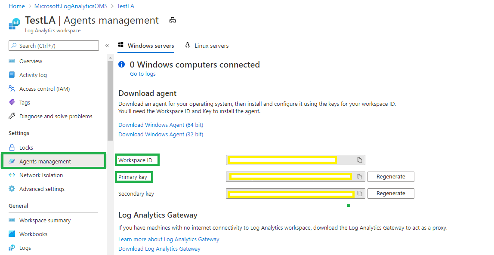
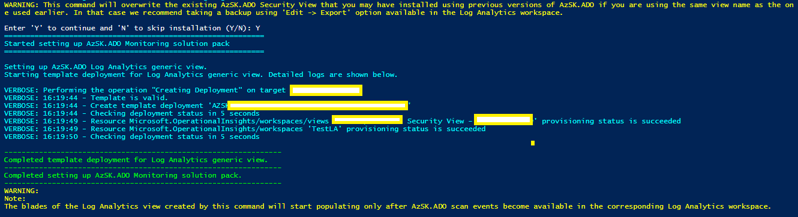
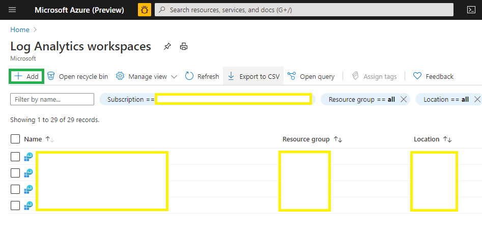
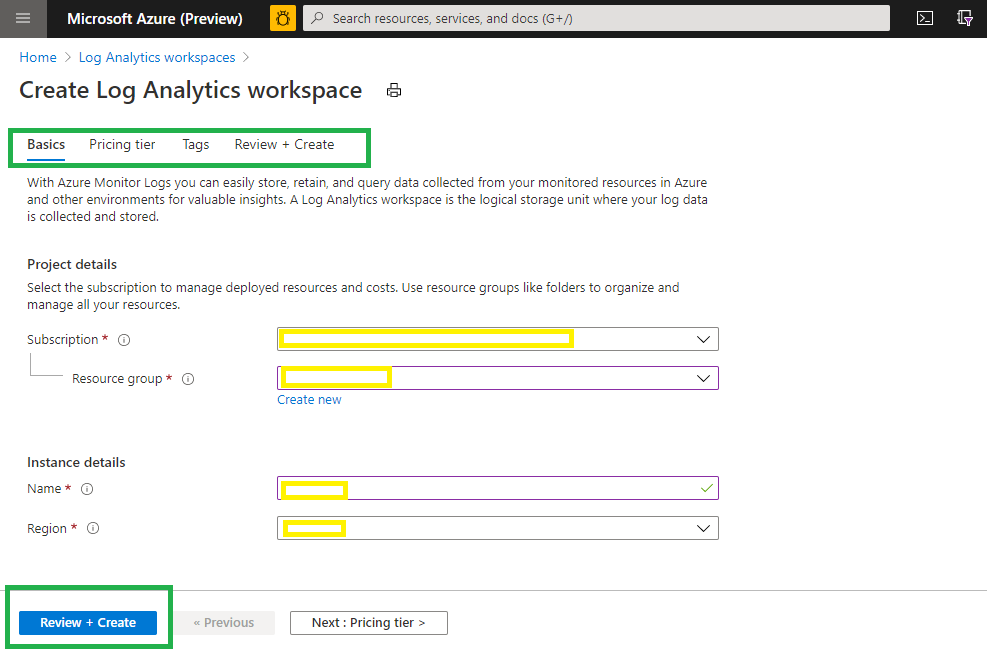

#  Tracking compliance for your ADO environment

----------------------------------------------

## Contents

  -  [Overview](Readme.md#overview)
  -  [Components of the AzSK.ADO Monitoring Solution](README.md#components-of-the-azskado-monitoring-solution)
  		-  [Setting up the AzSK.ADO Monitoring Solution](README.md#setting-up-the-azskado-monitoring-solution-step-by-step)
  			*  [Step-1: Deploy the AzSK.ADO Monitoring Solution](README.md#step-1-deploy-the-azskado-monitoring-solution)
  			*  [Step-2: Using the Log Analytics Workspace Summary (Overview) for monitoring](README.md#step-2-using-the-log-analytics-workspace-summary-overview-for-monitoring)
  			*  [Step-3: Using the Log Analytics Workbook for monitoring](README.md#step-3-using-the-log-analytics-workbook-for-monitoring)
  			*  [Appendix](README.md#appendix)
  -  [Webhook listener for control scan events](README.md#Webhook-listener-for-control-scan-events)
  
----------------------------------------------

 ## Overview: 
The monitoring features of AzSK.ADO empower devops teams with the following capabilities:
- a single pane of glass view of devops security.
- visibility to control status for their DevOps organizations.

Out of the box, these capabilities can be leveraged via Webhook listener and the Log Analytics-based Monitoring solution in AzSK.ADO.

However, a dev ops team can equally easily leverage a different system for log analytics (e.g., Splunk) and view the AzSK.ADO control evaluation events in the alternate system. This can be accomplished by using connectors for Event Hubs or Webhooks in the AzSK.ADO.

----------------------------------------------

## Components of the AzSK.ADO Monitoring Solution
The AzSK.ADO Monitoring Solution is deployed to a Log Analytics workspace that is used by the dev ops team for monitoring and generating a dashboard for security monitoring.

----------------------------------------------

## Setting up the AzSK.ADO Monitoring Solution (Step by Step)
This section will walk you through the step-by-step experience of setting up the AzSK.ADO Monitoring Solution.
If you do not have a Log Analytics workspace yet, see [Appendix](Readme.md#appendix) to create one.

This section assumes that:
a) you have a Log Analytics worskpace**
b) you have setup the local AzSK.ADO to send events to that workspace or ADO Security Scanner added to CICD pipeline or setup ADO Security Scanner in Azure using the continuous assurance feature.

### Step-1 : Deploy the AzSK.ADO Monitoring Solution

**[1-a]**
Obtain the workspaceId and sharedKey for the Log Analytics workspace you'd like to use for monitoring.
Go to the Log Analytics workspace and navigate to "Agents management -> Windows Servers" as shown in the image below:
> **Note**: The "Agents management" option will be visible only if you have 'Owners' access (and have elevated to Owner if using PIM). It will not be visible if you are 'Reader'.





**[1-b]**
Run the commands below in PS after replacing the various '<>' with
  (a) respective values for the Log Analytics workspace to be used
  and (b) a unique name to identify the view with in the Log Analytics workspace summary (Overview).

```PowerShell
    $lawsSubId ='<Log Analytics subscription id>'   #subscription hosting the Log Analytics workspace
    $lawsId ='<Log Analytics workspace id>'
    $lawsRGName ='<Log Analytics workspace resource group name>'     #RG where the Log Analytics workspace is hosted (See 1-a)
    $ADOViewName = '<unique_name_for_your_AzSK.ADO_view>' #This will identify the tile for AzSK.ADO view in Log Analytics workspace. E.g., MyApp-View-1
    $dashboardType = '<View/Workbook>' #Type of dashboard you want to deploy in log analytics workspace. 

    #This command will deploy the AzSK.ADO view in the Log Analytics workspace. Happy monitoring!
    Install-AzSKADOMonitoringSolution -LAWSSubscriptionId $lawsSubId `
			-LAWSResourceGroup $lawsRGName `
			-WorkspaceId $lawsId `
			-ViewName $ADOViewName,
			-DashboardType $dashboardType
```

The table below explains the different parameters used by Install-AzSKADOMonitoringSolution cmdlet:

|ParameterName|Comments|
| ----- | ---- | 
|LAWSSubscriptionId|Id of the subscription where the Log Analytics workspace is hosted|
|LAWSResourceGroup|Name of the resource group where the Log Analytics workspace is hosted|
|WorkspaceId|Workspace ID of the Log Analytics workspace name which will be used for monitoring|
|ViewName|Name of the AzSK.ADO Log Analytics Workspace summary/workbook (Overview) (unique per Log Analytics workspace)|
|DashboardType|Type of the view, whether log analytics workspace summary view or workbook|


The installation command will display output like the below:



----------------------------------------------

### Step-2 : Using the Log Analytics Workspace Summary (Overview) for monitoring

At this point, assuming that AzSK.ADO events were already being sent to the Log Analytics workspace, you should start
seeing a tile such as the one below:


**[2-a]** Viewing raw events from AzSK.ADO (sanity check)

Click on the 'Logs' in the menu bar on the left to open the "Logs" query page.

Enter "AzSK_ADO_CL" in the query field.


You should see data about AzSK.ADO events as query results. (Again, this assumes that by now AzSK.ADO 
control scan results are being sent to this workspace. See [this](Readme.md#b-testing-log-anaytics-workspace-connectivity) for
how that is done.)

 

If you are certain that events are being sent to the Log Analytics workspace but you are seeing blank views/no query results, 
you may need to extend the duration applicable to the queries. (This can be done using the 'Time range' selector next to the 'Run' button at the top of the query window.)


	
**[2-b]** Using the AzSK.ADO Monitoring Solution

The solution view contains multiple blades representing various types of security activity, 
security trends, etc. This view shows up when you click on the view tile and looks like the picture
below:


The very first (Summary) blade provides complete instructions on how to interpret the different
blades in this view. These blades cover the complete picture of baseline security compliance
for your organization and resources. It starts with a couple of blades that display organization
level security issues. The subsequent blades display resource level security queries - each 
blade takes a different pivot to show the resource compliance data. The very last blade
provides some handy queries that you can use to get started with building your own custom 
queries for log searches on top of the AzSK.ADO events in the repository.

----------------------------------------------

### Step-3 : Using the Log Analytics Workbook for monitoring**

You should start seeing a tile such as the one below:

**[3-a]** Workbook 


**[3-b]** Workbook Overview tiles

The solution workbook contains multiple blades representing various types of security activity, 
security trends, etc. This view shows up when you click on the view tile and looks like the picture
below:


The "Help" (Summary) blade provides complete instructions on how to interpret the different
blades in this view. These blades cover the complete picture of baseline security compliance
for your organization and resources. It starts with a couple of blades that display organization
level security issues. The subsequent blades display project level security queries - each 
blade takes a different pivot to show the resource compliance data. 

----------------------------------------------

## Appendix ##

### [A] If you don't have Log Analytics workspace, follow below steps: ###
**Step-1 :** Create a new Log Analytics workspace.

Go [here](https://docs.microsoft.com/en-in/azure/azure-monitor/learn/quick-create-workspace) and follow the simple steps to create a new Log Analytics workspace.
<kbd>

</kbd>
<kbd>

</kbd>
**Step-2 :** Capture the Workspace ID and Primary Key for the Log Analytics workspace by navigating to "Agents management" -> Windows Servers".


### [B] Enabling Log Anaytics workspace connectivity into AzSK.ADO and routing AzSK.ADO events to Log Analytics ###
Let us look at how to send events to the Log Analytics workspace from AzSK.ADO running on a local machine. This is a handy way to 
test connectivity and to see if the <Log Analytics workspace> Logs can display the received events.

**Step-1 :** Connect the local (dev box) installation of AzSK.ADO to your Log Analytics workspace for sending AzSK.ADO control evaluation events.

Run the below in a PS session (this assumes that you have the latest AzSK.ADO installed).
```PowerShell
 $wsID = 'workspace_ID_here'       #See pictures in [A] above for how to get wsId and shrKey
 $shrKey = 'workspace_PrimaryKey_here'
	
 Set-AzSKADOMonitoringSettings -WorkspaceID $wsID -SharedKey $shrKey
```
Close the current PS window and start a new one. (This is required for the new settings to take effect.)
After this, all AzSK.ADO cmdlets, SVTs, etc. run on the local machine will start sending events (outcomes of 
security scans) into the Log Analytics repository corresponding to the workspace ID above. To send logs from the ADOScanner added pipeline, add two pipeline variable LAWSId and LAWSSharedKey. 


**Step-2 :** Generate some AzSK.ADO events and validate that they are reaching the configured Log Analytics workspace.

Run a few AzSK.ADO cmdlets to generate events for the Log Analytics repo. 
For example, you can run one or both of the following:

```PowerShell
 Get-AzSKADOSecurityStatus -OrganizationName "OrgName" 
 Get-AzSKADOSecurityStatus -OrganizationName "OrgName" -ProjectNames "PrjName"
```

After the above scans finish, if we go into Log Analytics workspace Logs and search for 'AzSK_ADO_CL', it should show 
AzSK.ADO events similar to the below ("_CL" stands for "custom log"):

----------------------------------------------

## Webhook listener for control scan events

The ```Set-AzSKADOWebhookSettings``` command supports post scan events to a webhook. This enables integration with arbitrary monitoring/security analytics systems (e.g., Splunk, EventGrid, etc.).

```PowerShell
 Set-AzSKADOWebhookSettings -WebhookUrl $webhookUrl -AuthZHeaderName $authZHeaderName -AuthZHeaderValue $authZHeaderValue
```
|Param Name|Purpose|Required?|Default value|
|----|----|----|----|
|WebhookUrl| All the scan results shall be posted to this configured webhook |TRUE|None|
|WebhookAuthZHeaderName| Name of the AuthZ header (typically 'Authorization')|FALSE|None|
|WebhookAuthZHeaderValue| Value of the AuthZ header |FALSE|None|

----------------------------------------------
