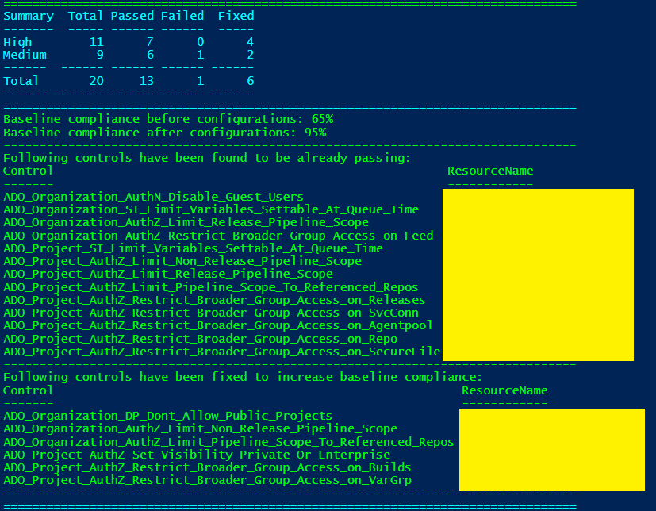
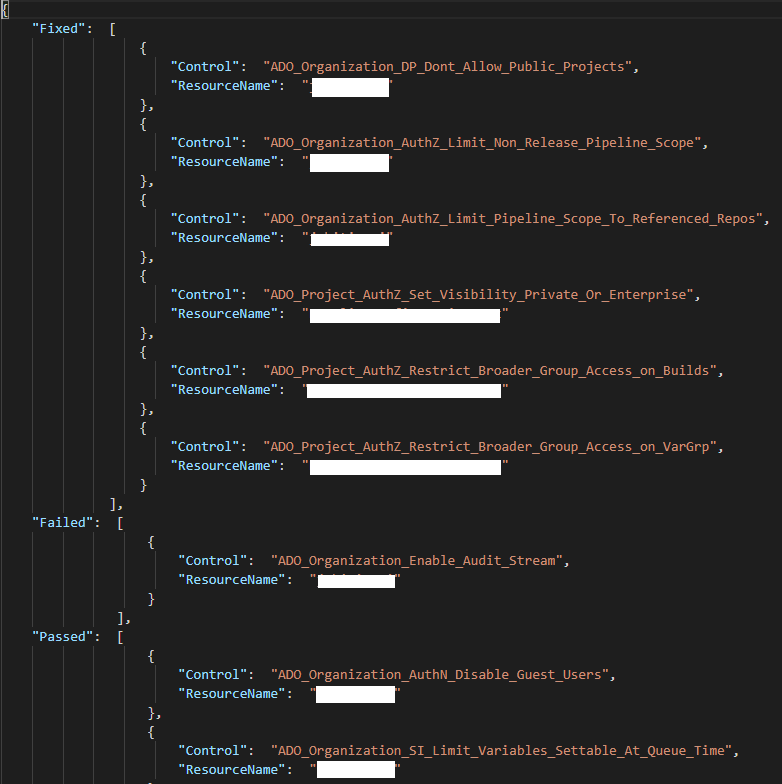

## Miscellaneous Features

- [ADO Scanner information helper command](Readme.md#ado-scanner-information-helper-command)
- [Execute SVTs using "-AllowLongRunningScan" switch](Readme.md#Execute-SVTs-using--AllowLongRunningScan-switch)
- [Scan using "-PolicyProject" parameter](Readme.md#Scan-using--PolicyProject-parameter)
- [Scan using "-ServiceId" parameter](Readme.md#Scan-using--ServiceId-parameter)
- [Configure an ADO organization to be baseline compliant](Readme.md#Configure-an-ADO-organization-to-be-baseline-compliant)

# ADO Scanner information helper command
### Overview

This command provides overall information about the ADO scanner which includes security controls information (severity, description, rationale, baseline etc.) and host information (ADO scanner settings/configuration, logged-in ADO user context etc.). 'Get-AzSKADOInfo' command can be used with 'InfoType' parameter to fetch information.

### Control information 

Run below command to get information about Azure DevOps security control(s). Control summary will be displayed on PS console by default. To get control information on PS console use -Verbose argument. 

```PowerShell
        $orgName = '<name of ADO org>'
	Get-AzSKADOInfo -OrganizationName $orgName `
                -InfoType 'ControlInfo' `
                [-ResourceTypeName <ResourceTypeName>] `
                [-ControlIds <ControlIds>] `
                [-UseBaselineControls] `
				[-UsePreviewBaselineControls] `
		[-ControlSeverity <ControlSeverity>] `
		[-ControlIdContains <ControlIdContains>] `
		[-Verbose]
```

|Param Name|Purpose|Required?|Default value|
|----|----|----|----|
|ResourceTypeName|Friendly name of resource type. E.g., Organization, Project, Build, Release etc.|FALSE|All|
|ControlIds|Comma-separated list of Control Ids|FALSE|None|
|UseBaselineControls|The flag used to get details of controls defined in baseline|FALSE|None|
|UsePreviewBaselineControls|The flag used to get details of controls defined in preview baseline|FALSE|None|
|ControlSeverity|Filter by severity of control E.g., Critical, High, Medium, Low|FALSE|None|
|ControlIdContains|Filter by ControlId(s) contains keyword|FALSE|None|
|Verbose|Get information on PS console|FALSE|None|


Below is the sample output:

Output of control details summary
<kbd>
  
</kbd>

### Host information  

Run below command to get information about,
* Loaded PS modules in PS session
* Logged in user's details
* AzSK ADO settings
* AzSK ADO configurations
* ADO context

```PowerShell
	$orgName = '<name of ADO org>'
	Get-AzSKADOInfo -OrganizationName $orgName `
                -InfoType 'HostInfo'
```

Below is the sample output:
<kbd>
  
</kbd>

### User information

Run below command to get information about,
* Membership details of current logged in user
* User permissions at organization level if no project name is provided
* User permissions at project level if project name is provided

***This command currently supports user permission information for a single project. Please provide a single project name.***

```PowerShell
	$orgName = '<name of ADO org>'
	Get-AzSKADOInfo -OrganizationName $orgName `
                -InfoType 'UserInfo' `
                [-ProjectNames <ProjectName>]
```

----------------------------------------------

### Execute SVTs using "-AllowLongRunningScan" switch

To scan large number of project component (more then 1000 resources default value), you need to supply an additional switch parameter -AllowLongRunningScan in the command.
```PowerShell
Get-AzSKADOSecurityStatus -OrganizationName "<OrganizationName>" -ProjectNames "<PRJ1, PRJ2,...etc.>" -AllowLongRunningScan
```
Allowing scan for more then 1000 resources can be configured through the organization policy by updating 'IsAllowLongRunningScan' and 'LongRunningScanCheckPoint' properties in the ControlSettings.json file. 
If 'IsAllowLongRunningScan' is set to true, then by using '-AllowLongRunningScan' switch parameter, AzSK.ADO allows scan for resources count which is set in 'LongRunningScanCheckPoint'. If 'IsAllowLongRunningScan' value is set to false it does not allow scan for more then resources count set in 'LongRunningScanCheckPoint'.

----------------------------------------------

# Scan using "-PolicyProject" parameter

 Using -PolicyProject parameter you can specify the name of the project to read and write attestation details and fetch organization policy for organization.
 
 For example: 
```PowerShell  
#Using PolicyProject parameter
$orgName = '<Organization name>'
$policyProject = '<Name of the project hosting organization policy with which the scan should run.>'
Get-AzSKADOSecurityStatus -OrganizationName $orgName -PolicyProject $policyProject

#Attesting a control using PolicyProject parameter
Get-AzSKADOSecurityStatus -OrganizationName $orgName -PolicyProject $policyProject -ControlsToAttest NotAttested -ResourceTypeName Organization
```
----------------------------------------------

# Scan using "-ServiceId" parameter

Using the -ServiceId flag one can scan resources associated with a service in an organization. This is applicable if the organization provides a mapping of services to ADO resources (e.g., via a ‘Service Tree’ type repository of service metadata). The parameter can be used as follows:
```PowerShell 
Get-AzSKADOSecurityStatus -OrganizationName $orgName `
                             -ProjectNames $projectName `
                             -ServiceId $serviceId
```

----------------------------------------------

# Configure an ADO organization to be baseline compliant

### Overview
If you have newly onboarded to Azure DevOps and want to start fresh with a securely configured Organization and Project, you can use the *Set-AzSKADOBaselineConfigurations* command. The command will scan the organization/project for baseline controls and fix any of the controls that have failed. Instead of manually running the scans and fixing the controls, you can automatically fix all of the covered controls. This ensures you start with a secured configuration. 

### Usage

```PowerShell

#To configure organization and project controls
Set-AzSKADOBaselineConfigurations -OrganizationName $orgName `
                                  -ProjectName $ProjectName

#To configure organization and project controls for all projects
Set-AzSKADOBaselineConfigurations -OrganizationName $orgName `
                                  -ProjectName *
                                  
Set-AzSKADOBaselineConfigurations -OrganizationName $orgName 

#To configure only project controls
Set-AzSKADOBaselineConfigurations -OrganizationName $orgName `
                                  -ProjectName $ProjectName `
                                  -ResourceTypeName Project                                  

```
> If the organization or the project seem to be old and functionally working, the scanner will not fix these controls. If you still wish to configure these security failures you must use *-force* switch
```PowerShell
#To configure organization and project controls and override the scanner behaviour to not fix these controls if found to be operationally working environment
Set-AzSKADOBaselineConfigurations -OrganizationName $orgName `
                                  -ProjectName $ProjectName `
                                  -force
```
> The controls fixed by the scanner cannot be reverted back to the original state using the command. In case you want to restore the previous state, you will have to manually configure them on Azure DevOps.

### Controls covered
The following controls are evaluated and fixed by the command:
- Organization
  - ADO_Organization_AuthZ_Limit_Non_Release_Pipeline_Scope
  - ADO_Organization_AuthZ_Limit_Pipeline_Scope_To_Referenced_Repos
  - ADO_Organization_AuthZ_Limit_Release_Pipeline_Scope
  - ADO_Organization_SI_Limit_Variables_Settable_At_Queue_Time
  - ADO_Organization_DP_Dont_Allow_Public_Projects
  - ADO_Organization_AuthN_Disable_Guest_Users
  - ADO_Organization_AuthZ_Restrict_Broader_Group_Access_on_Feed
  - ADO_Organization_Enable_Audit_Stream
- Project
  - ADO_Project_AuthZ_Limit_Non_Release_Pipeline_Scope
  - ADO_Project_AuthZ_Limit_Pipeline_Scope_To_Referenced_Repos
  - ADO_Project_AuthZ_Limit_Release_Pipeline_Scope
  - ADO_Project_SI_Limit_Variables_Settable_At_Queue_Time
  - ADO_Project_AuthZ_Set_Visibility_Private_Or_Enterprise
  - ADO_Project_AuthZ_Restrict_Broader_Group_Access_on_Builds
  - ADO_Project_AuthZ_Restrict_Broader_Group_Access_on_Releases
  - ADO_Project_AuthZ_Restrict_Broader_Group_Access_on_SvcConn
  - ADO_Project_AuthZ_Restrict_Broader_Group_Access_on_AgentPool
  - ADO_Project_AuthZ_Restrict_Broader_Group_Access_on_VarGrp
  - ADO_Project_AuthZ_Restrict_Broader_Group_Access_on_Repo
  - ADO_Project_AuthZ_Restrict_Broader_Group_Access_on_SecureFile

### Understanding Baseline Configurations summary

At the end of the scan you will presented with a percentage increase in baseline compliance and the list of controls that have been fixed.
</br>
<kbd>

</kbd>

You will also be given a BaselineConfigurations.json file that contains a list of control that were passing, controls that were fixed and controls that need to be fixed manually.

</br>
<kbd>

</kbd>

