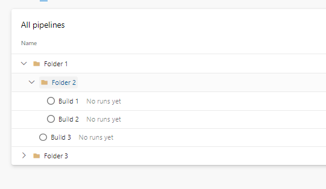

# AzSK.ADO PowerShell module SDL based scan

## Contents

  -  [Overview](Readme.md#overview)
  -  [Setup](Readme.md#Setup)
  	 -  [Installation Guide](Readme.md#installation-guide)
  -  [Getting Started](Readme.md#getting-started)
  	 -  [Import ADO module](Readme.md#import-ado-module)
 	 -  [Scanning Admin Controls](Readme.md#scanning-admin-controls)
 	 -  [Scanning Non-Admin Controls](Readme.md#scanning-non-admin-controls)
  -  [Org-specific customization](Readme.md#customizing-adoscanner-using-org-policy)
	 -  [Overview](Readme.md#Introduction)
	 -  [Setting up org policy](Readme.md#setting-up-org-policy)
	 -  [Consuming custom org policy](Readme.md#consuming-custom-org-policy)
	 -  [Changing a control setting for specific controls](Readme.md#changing-control-settings)
  -  [Compliance visibility](Readme.md#compliance-visibility)
  	 -  [Deploy the AzSK.ADO Monitoring Solution](Readme.md#deploy-the-azskado-monitoring-solution)
  	 -  [Using the Log Analytics Workspace Summary for scan logs](Readme.md#using-the-log-analytics-workspace-for-scan-logs)
  	 -  [Using the Log Analytics Workbook for monitoring](Readme.md#using-the-log-analytics-workbook-for-monitoring)
  -  [FAQs](Readme.md#faqs)
  -  [Support](Readme.md#Support)
 
  
  
----------------------------------------------

## Overview
Security Scanner for Azure DevOps (AzSK.ADO) helps you keep your ADO resource types such as various org/project settings, build/release configurations, service connections, agent pools, , feeds, repositories, securefiles, environments etc. configured securely. 

> At its core, the Security Scanner for ADO is a PowerShell module. This can be run locally from the PS console after installation. This is as simple as running PS in non-Admin mode and running the scan cmds.

The purpose of this document is to help the end users to install, configure and use various features of ADOScanner in SDL mode to drive the compliance for their ADO organizations.

----------------------------------------------

## Setup 

### Installation Guide

>**Pre-requisites**:
> - PowerShell 5.0 or higher. 

1. First verify that prerequisites are already installed:  
    Ensure that you have PowerShell version 5.0 or higher by typing **$PSVersionTable** in the PowerShell ISE console window and looking at the PSVersion in the output as shown below.) 
 If the PSVersion is older than 5.0, update PowerShell from [here](https://www.microsoft.com/en-us/download/details.aspx?id=54616). 
 
 <kbd>
   
</kbd>


2. Install the Security Scanner for Azure DevOps (AzSK.ADO) PS module:  
	  
```PowerShell
  Install-Module AzSK.ADO -Scope CurrentUser -AllowClobber -Force
```

----------------------------------------------

## Getting Started

### Import ADO module
To run the scans, we need to import AzSK.ADO module in powershell.
```PowerShell
Import-Module AzSK.ADO
```
### Scanning Admin Controls

Admin controls always refer to the controls associated with organization or project.

> Project Collection Administrator access (PCA) and Project Administrator(PA) access is required to scan organization and project controls respectively. Otherwise, the scan results depends on the access/permission level of the identity running the scanner.

To scan the admin controls, it is always recommended to use `-IncludeAdminControls` switch.

Run the command below after replacing `<OrganizationName>` with your ADO org name 
and `<ProjectNames>` with the comma separated list of project names where your ADO resources are hosted.
You will get organization name from your ADO organization url e.g. http://SampleADOOrg.visualstudio.com. In this 'SampleADOOrg' is org name.

```PowerShell
$orgName = "<OrganizationName>"
$projName = "<ProjectNames>"
Get-AzSKADOSecurityStatus -OrganizationName $orgName -ProjectNames $projName -IncludeAdminControls
```

The outcome of the security scan/analysis is printed on the console during SVT execution and a CSV and LOG files are 
also generated for subsequent use.

The CSV file and LOG file are generated under a org-specific sub-folder in the folder  
*%LOCALAPPDATA%\Microsoft\AzSK.ADOLogs\Org_[yourOrganizationName]*  
E.g.  C:\Users\<UserName>\AppData\Local\Microsoft\AzSK.ADOLogs\Org_[yourOrganizationName]\20181218_103136_GADS

## Scanning non-admin Controls

Non-admin controls always refer to the controls associated with any of the resource types other than organization or project. i.e Build/Release/AgentPool/ServiceConnection/VariableGroup/SecureFile/Repo/Feeds.

For example, to scan all builds in a project, run the command below after replacing `<OrganizationName>` with your ADO org name 
and `<ProjectNames>` with a comma separated list of project names where your ADO resources are hosted.

```PowerShell
$orgName = "<OrganizationName>"
$projName = "<ProjectNames>"
Get-AzSKADOSecurityStatus -OrganizationName $orgName -ProjectNames $projName -ResourceTypeName Build 
```
Command also supports other parameters of filtering resources.

```PowerShell
#To scan selected builds in a project
$buildNames = <Comma sepated build names to filter>
Get-AzSKADOSecurityStatus -OrganizationName $orgName -ProjectNames $projName -ResourceTypeName Build  -BuildNames $buildNames"

#Scan all supported artifacts
Get-AzSKADOSecurityStatus -OrganizationName $orgName  -ProjectNames $projName -ScanAllResources

#Scan resources for baseline controls only
Get-AzSKADOSecurityStatus -OrganizationName $orgName -ProjectNames $projName  -ResourceTypeName Build  -ubc

#Scan controls with particular tags only
Get-AzSKADOSecurityStatus -OrganizationName $orgName -ProjectNames $projName  -ResourceTypeName Build  -FilterTags "<Comma sepated tags to filter>"
```
Check the other parameters supported by command  [here](https://github.com/azsk/ADOScanner-docs/blob/master/02-%20Running%20ADO%20Scanner%20from%20command%20line/Readme.md).

> **Note:** Use the switch "-AllowLongRunningScan" if the number of resources scanning are more than 1000 to acknowledge the acceptance of long running scan.

----------------------------------------------

### Execute SVTs using "-UsePartialCommits" switch

The Get-AzSKADOSecurityStatus command now supports checkpointing via a "-UsePartialCommits" switch. When this switch is used, the command periodically persists scan progress to disk. That way, if the scan is interrupted or an error occurs, a future retry can resume from the last saved state. The cmdlet below checks security control state via a "-UsePartialCommits" switch:
```PowerShell
Get-AzSKADOSecurityStatus-OrganizationName "<OrganizationName>" -ScanAllResources -UsePartialCommits
```
----------------------------------------------

### Speed up checkpointed scans with "-DoNotRefetchResources" switch
The "-UsePartialCommits" switch also supports an optional switch: "-DoNotRefetchResources" in SDL mode. When this switch is used, resources are not re-fetched during the continuation of the checkpointed scan (i.e., when the "-upc" switch is used). This efficiently speeds up scans of subsequent batches after the initial one. Currently the resources supported with the switch are Release, Agent Pool, Organization and Project. 

```PowerShell
Get-AzSKADOSecurityStatus -OrganizationName "<OrganizationName>" -ProjectName "<ProjectName>" -ReleaseNames * -ResourceTypeName Release -UsePartialCommits -DoNotRefetchResources
```

----------------------------------------------

### Execute path based scanning for builds and releases
The Get-AzSKADOSecurityStatus command supports path based scanning by scanning build and release configs constrained to specific build and release folder paths. This is achieved via two switches : "-BuildsFolderPath" and "-ReleasesFolderPath".
```PowerShell
Get-AzSKADOSecurityStatus -OrganizationName "<OrganizationName>" -ProjectName "<ProjectName>" -ReleaseNames * -ResourceTypeName Release -ReleasesFolderPath "<ReleasesFolderPath>"

Get-AzSKADOSecurityStatus -OrganizationName "<OrganizationName>" -ProjectName "<ProjectName>" -BuildNames * -ResourceTypeName Build -BuildsFolderPath "<BuildsFolderPath>"
```
Consider the following build folder structure: </br>
<kbd>

</kbd>
 </br>
To scan builds inside "Folder 1", the path should be given as "Folder 1". This will scan all builds inside this folder (i.e., Build 1, Build 2 and Build 3). To scan all builds inside "Folder 2", the path should be "Folder 1\Folder 2". This will scan Build 1 and Build 2.

----------------------------------------------


### Customize location for scan reports
The location to save scan reports can be customized using the command below:
```Powershell
Set-AzSKADOUserPreference -OutputFolderPath '<Custom folder path>'
```
The location to save scan report can be reset to default using command below:
```Powershell
Set-AzSKADOUserPreference -ResetOutputFolderPath
```

----------------------------------------------
## Customizing ADOScanner using org policy

### Introduction

### When and why should I setup org policy

When you run any scan command from AzSK.ADO, it relies on JSON-based policy files to determine various parameters that effect the behavior of the command it is about to run. These policy files are downloaded 'on the fly' from a policy server. When you run the public version of the scanner, the offline policy files present in the module are accessed. Thus, whenever you run a scan from a vanilla installation, AzSK.ADO accesses the offline file present in the module to get the policy configuration and runs the scan using it.

The JSON inside the policy files dictate the behavior of the security scan.
This includes things such as:
 - Which set of controls to evaluate?
 - What control set to use as a baseline?
 - What settings/values to use for individual controls?
 - What messages to display for recommendations? Etc.

 While the out-of-box files in the module may be good for limited use, in many contexts you may want to "customize" the behavior of the security scans for your environment. You may want to do things such as: (a) enable/disable
some controls, (b) change control settings to better match specific security policies within your project, (c) change various messages, (d) add additional filter criteria for certain regulatory requirements that teams in your project can leverage, etc. When faced with such a need, you need a way to create and manage
a dedicated policy endpoint customized to the needs of your environment. The organization policy setup feature helps you do that in an automated fashion.


### How does AzSK.ADO use online policy?

Let us look at how policy files are leveraged in a little more detail.

When you install AzSK.ADO, it downloads the latest AzSK.ADO module from the PS Gallery. Along with this module there is an *offline* set of policy files that go in a sub-folder under the %userprofile%\documents\WindowsPowerShell\Modules\AzSK.ADO\<version> folder. It also places (or updates) an AzSKSettings.JSON file in your %LocalAppData%\Microsoft\AzSK.ADO folder that contains the policy endpoint (or policy server) URL that is used by all local commands.

Whenever any command is run, AzSK.ADO uses the policy server URL to access the policy endpoint. It first downloads a 'metadata' file that contains information about what other files are available on the policy server. After
that, whenever AzSK.ADO needs a specific policy file to actually perform a scan, it loads the local copy of the policy file into memory and 'overlays' any settings *if* the corresponding file was also found on the
server-side.

It then accesses the policy to download a 'metadata' file that helps it determine the actual policy files list that is present on the server. Thereafter, the scan runs by overlaying the settings obtained from the server with
the ones that are available in the local installation module folder. This means that if there hasn't been anything overridden for a specific feature (e.g., Project), then it won't find a policy file for that listed in the server
 metadata file and the local policy file for that feature will get used.

### Setting up org policy

#### Steps to setup org policy setup

1. Create a Git repository in your project by importing this [repo](https://github.com/azsk/ADOScanner_Policy.git). [Project -> Repos -> Import repository -> Select 'Git' as repository type -> Enter 'https://github.com/azsk/ADOScanner_Policy.git' as clone URL -> Enter 'ADOScannerPolicy' as name].

It will import a very basic 'customized' policy involving below files uploaded to the policy repository.

##### Basic files setup during policy setup

| File | Description
| ---- | ---- |
| AzSK.json | Includes org-specific message, installation command etc.
| ServerConfigMetadata.json | Index file with list of policy files.

> Check the other advanced features supported by org policy [here](https://github.com/azsk/ADOScanner-docs/tree/master/08-%20Customizing%20ADOScanner%20for%20your%20org).

----------------------------------------------

### Consuming custom org policy

Follow the steps below for consuming the org policy:

#### 1. Running scan in local machine with custom org policy

 To run scan with custom org policy from any machine, run the below command

```PowerShell
#Run scan cmdlet and validate if it is running with org policy
Get-AzSKADOSecurityStatus -OrganizationName "<Organization name>" -ProjectNames "<Project name where the org policy is configured>"

#Using 'PolicyProject' parameter
Get-AzSKADOSecurityStatus -OrganizationName "<Organization name>" -PolicyProject "<Name of the project hosting organization policy with which the scan should run.>"

```
> **Note**: Using PolicyProject parameter you can specify the name of the project hosting organization policy with which the scan should run.

#### 2. Local folder-based org policy support

To facilitate use of ADO Scanner locally (from desktop console) for driving compliance for an org, we have added support to run against org policy (custom control settings, etc.) from a local folder. This capability can be used by org/project admins to evaluate ADO Scanner and fine tune its configuration for their org/environment before deploying the org policy as a policy repo.

```PowerShell
#Command to configure a local folder as source of org policy:
Set-AzSKADOPolicySettings -LocalOrgPolicyFolderPath "<Folder path where the org policy is configured>"

#To reset the org policy to default location:
Set-AzSKADOPolicySettings -RestoreDefaultOrgPolicySettings
```
> **Note**: LocalOrgPolicyFolderPath should contain the file ServerConfigMetadata.json  with list of policy files mentioned in it.

----------------------------------------------

### Changing control settings
The settings  that alter scan behaviour, metrics, control results are generally configured in a file named ControlSettings.json. Using this file we can modify baseline control set for each  resource type, change the update frequency of partial scan, modify the thresolds, parameters for each control etc. Because the first-time org policy setup does not customize anything from this, we will first need to copy this file from the local AzSK.ADO installation.

The local version of this file should be in the following folder:
```PowerShell
    %userprofile%\Documents\WindowsPowerShell\Modules\AzSK.ADO\<version>\Framework\Configurations\SVT
```
<kbd>
   
</kbd>
Note that the 'Configurations' folder in the above picture holds all policy files (for all features) of AzSK.ADO. We
will make copies of files we need to change from here and place the changed versions in the org-policy repo.
Again, you should **never** edit any file directly in the local installation policy folder of AzSK.ADO.
Rather, **always** copy the file and edit it.

###### Steps:

 i) Copy the ControlSettings.json from the AzSK.ADO installation to your org-policy repo.

 ii) Remove everything except the "BuildHistoryPeriodInDays" line while keeping the JSON object hierarchy/structure intact.
<kbd>
  
</kbd>

 iii) Commit the file.

 iv) Add an entry for *ControlSettings.json* in *ServerConfigMetadata.json* (in the repo) as shown below.
<kbd>
 
 </kbd>
###### Testing:

Anyone in your project can now start a fresh PS console and the result of the evaluation whether a build pipeline is inactive in
the build security scan (Get-AzSKADOBuildSecurityStatus) should reflect that the new setting is in
effect. (E.g., if you change the period to 90 days and if the pipeline was inactive from past 120 days, then the result for control (ADO_Build_SI_Review_Inactive_Build) will change from 'Passed' to 'Failed'.)


Check the advanced features supported by org policy [here](https://github.com/azsk/ADOScanner-docs/tree/master/08-%20Customizing%20ADOScanner%20for%20your%20org).

----------------------------------------------
## Compliance visibility

The AzSK.ADO Monitoring Solution is deployed to a Log Analytics workspace that can be used for monitoring and generating a dashboard for security monitoring.

### Deploy the AzSK.ADO Monitoring Solution

This section will walk you through the step-by-step experience of setting up the AzSK.ADO Monitoring Solution.

This section assumes that:
a) you have a Log Analytics worskpace**
b) you have setup the local AzSK.ADO to send events to that workspace.

#### Obtain the workspaceId and sharedKey for the Log Analytics workspace you'd like to use for monitoring.
Go to the Log Analytics workspace and navigate to "Agents management -> Windows Servers" as shown in the image below:
> **Note**: The "Agents management" option will be visible only if you have 'Owners' access (and have elevated to Owner if using PIM). It will not be visible if you are 'Reader'.

<kbd>

</kbd>

#### Run the commands below in PS after replacing the various '<>' with
  (a) respective values for the Log Analytics workspace to be used
  and (b) a unique name to identify the view with in the Log Analytics workspace summary (Overview).

```PowerShell
    $lawsSubId ='<Log Analytics subscription id>'   #subscription hosting the Log Analytics workspace
    $lawsId ='<Log Analytics workspace id>'
    $lawsRGName ='<Log Analytics workspace resource group name>'     #RG where the Log Analytics workspace is hosted (See 1-a)
    $ADOViewName = '<unique_name_for_your_AzSK.ADO_view>' #This will identify the tile for AzSK.ADO view in Log Analytics workspace. E.g., MyApp-View-1
    $dashboardType = 'Workbook' #Type of dashboard you want to deploy in log analytics workspace. 

    #This command will deploy the AzSK.ADO view in the Log Analytics workspace. Happy monitoring!
    Install-AzSKADOMonitoringSolution -LAWSSubscriptionId $lawsSubId `
			-LAWSResourceGroup $lawsRGName `
			-WorkspaceId $lawsId `
			-ViewName $ADOViewName,
			-DashboardType $dashboardType
```

The table below explains the different parameters used by Install-AzSKADOMonitoringSolution cmdlet:

|ParameterName|Comments|
| ----- | ---- | 
|LAWSSubscriptionId|Id of the subscription where the Log Analytics workspace is hosted|
|LAWSResourceGroup|Name of the resource group where the Log Analytics workspace is hosted|
|WorkspaceId|Workspace ID of the Log Analytics workspace name which will be used for monitoring|
|ViewName|Name of the AzSK.ADO Log Analytics Workspace summary/workbook (Overview) (unique per Log Analytics workspace)|
|DashboardType|Type of the view, whether log analytics workspace summary view or workbook|


The installation command will display output like the below:
<kbd>

</kbd>
----------------------------------------------

### Using the Log Analytics Workspace for scan logs

####  Viewing raw events from AzSK.ADO (sanity check)

Click on the 'Logs' in the menu bar on the left to open the "Logs" query page.

Enter "AzSK_ADO_CL" in the query field.


You should see data about AzSK.ADO events as query results. (Again, this assumes that by now AzSK.ADO 
control scan results are being sent to this workspace.
<kbd>
 
</kbd>
----------------------------------------------

### Using the Log Analytics Workbook for monitoring

Once the scan events are published to Log Analytics Workspace, the workbook created above will have compliance details with various security trends.
To view the workbook created, Goto : Log Analytics Workspace --> General --> Workbook --> click on the newly created workbook.

#### Workbook Overview tiles

The solution workbook contains multiple blades representing various types of security activity, 
security trends, etc. This view shows up when you click on the view tile and looks like the picture
below:
<kbd>

</kbd>

The "Help" (Summary) blade provides complete instructions on how to interpret the different
blades in this view. These blades cover the complete picture of baseline security compliance
for your organization and resources. It starts with a couple of blades that display organization
level security issues. The subsequent blades display project level security queries - each 
blade takes a different pivot to show the resource compliance data. 

----------------------------------------------

## FAQs

#### Error message: "Running scripts is disabled on this system..."
This is an indication that PowerShell script loading and execution is disabled on your machine. You will need to enable it before the ADOScanner installation script (which itself is a PowerShell script) can run. 
```PowerShell
Get-ExecutionPolicy -Scope CurrentUser
```
If you run above command in the PS console, you will likely see that the policy level is either 'Restricted' or 'Undefined'. For AzSK cmdlets to run, it needs to be set to 'RemoteSigned'.
To resolve this issue run the following command in your PS console:
```PowerShell
Set-ExecutionPolicy -ExecutionPolicy RemoteSigned -Scope CurrentUser
```
The execution policy setting will be remembered and all future PS consoles opened in non-Admin (CurrentUser) mode will apply the 'RemoteSigned' execution policy.

#### Error message: The remote server returned an error: (401) Unauthorized
If you encounter the error message `Organization not found: Incorrect organization name or you do not have necessary permission to access the organization. InvalidOperation: The remote server returned an error: (401) Unauthorized`, this could mean that the logged in identity does not have access to the organization. 

To ensure the tool use the correct identity, you can force the sign-in dialog to appear by setting a variable. 
Here's how you can accomplish this: 

```PowerShell
$AzSKADOLoginUI = 1       ## Helps you ensure you log in with the correct identity
Import-Module AzSK.ADO
# > Run your commands again now.
```

#### How to register with PSGallery
Use below command :
```PowerShell
Register-PSRepository -Name PSGallery -SourceLocation https://www.powershellgallery.com/api/v2/ -InstallationPolicy Trusted
```

### Support
- For any other issues or feedback please drop a mail to <a href="mailto:azskadosup@microsoft.com">ADO Scanner Support</a>
